# Wstęp do programowania systemowego w Linux

## Podstawowe pojęcia

- **Program** - sekwencja instrukcji wyrażonych w języku programowania, który komputer jest w stanie zinterpretować i wykonać.
- **System operacyjny** - program który tworzy środowisko do uruchamiania programów, zarządza dostępem procesu do zasobów sprzętowych,.
- **Proces** - kod który się wykonuje, (akt wykonywania kody).
- **Wątek** - najmniejsza jednostka wykonywanego kodu, która może być zaplanowana przez planiste (ang. Scheduler).
- **Procesor** - układ scalony, który wykonuje instrukcje pobierane z pamięci operacyjnej.
- **Wywołanie systemowe** - przerwanie procesu i żądanie przez ten proces wykonania przez system operacyjny operacji uprzywilejowanej.

# Wielozadaniowość

## Co to jest wielozadaniowość

Wielozadaniowość oznacza, że system operacyjny może wykonywać wiele zadań jednocześnie.
W przypadku maszyn jednoprocesorowych, system sprawia wrażenie wykonującego wiele zadań
jednocześnie, a w rzeczywistości przydziela czas procesora na przemian kilku procesom.

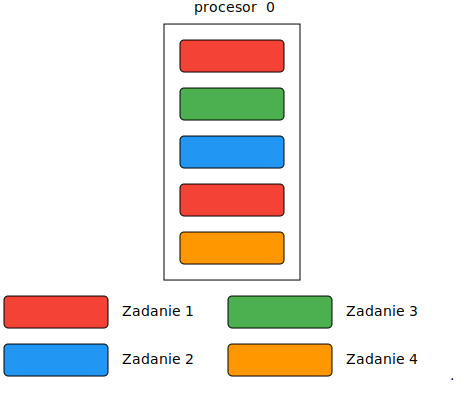

## Wielozadaniowość na wielu procesorach/rdzeniach

W przypadku wielu procesorów, system operacyjny może uruchamiać procesy
rzeczywiście równolegle

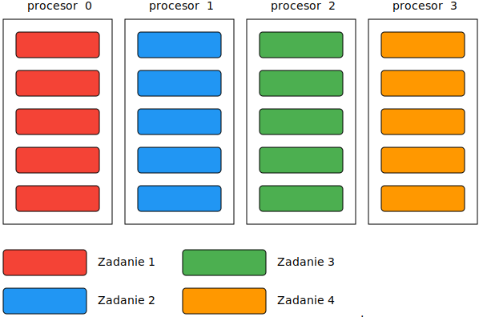

## Wielozadaniowość na wielu procesorach/rdzeniach

W praktyce procesy mogą być uruchamiane na różnych rdzeniach procesora.

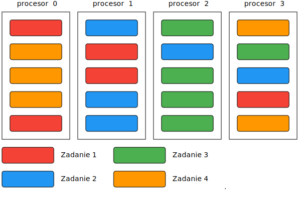

## Afiniczność procesora

W Linux'ie możemy określić na których procesorach będzie wykonywany proces

```bash
$ taskset -p 0x11 9726
```

Podobne ustawienie istnieje również w menedżerze zadań systemu Windows

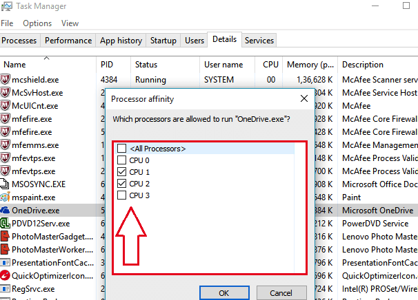

# Procesy

## Procesy w systemie Linux

Procesem nazywamy program, który się wykonuje.
W skład procesu wchodzą:

- **Stan procesora (rejestry).** Dla `x86_64` są to:
    - `rbp` - wskaźnik początku stosu
    - `rsp` - wskaźnik końca stosu (ang. Stack pointer)
    - `rip` - wskaźnik aktualnej instrukcji (ang. Program counter)
    - `rflags` - rejest flag procesora
    - rejestry ogólnego przeznaczenia: `rax`, `rcx`, `rdx`, `rbx`, `rsi`, `rdi`, `r8`-`r15`
- **Pamięć wirtualna** (Tabela stron) (wskazywana przez `CR3`)
- **Deskryptory plików**, czyli (najważniejsze):
    - pliki (otwarte za pomocą `open()`)
    - gniazda sieciowe (otwarte za pomocą `socket()`, `accept()`)
    - potoki (otwarte za pomocą `pipe()`)
    - demultiplexery zdarzeń (otwarte za pomocą `epoll_create()`)
- Inne struktury danych istotne dla jądra Linux

## Podglądanie procesów w systemie

W systemie Linux, uruchomione procesy możemy zobaczyć za pomocą
programu `ps`

```console
$ ps
  PID TTY           TIME CMD
  896 ttys000    0:00.10 -bash
 1073 ttys001    0:00.08 -bash
 7601 ttys001    0:00.02 bash /Users/hehe/v/e @
 7603 ttys001    1:40.37 nvim
 1074 ttys002    0:00.15 -bash
75444 ttys002    0:00.00 (sleep)
 6110 ttys003    0:00.50 -bash
75450 ttys003    0:00.00 bash /Users/hehe/v/y
 7870 ttys004    0:00.09 -bash
75448 ttys004    0:00.00 sleep 1
```

Liczba `PID` to unikalny identyfikator procesu.

## Podglądanie procesów w systemie - top

Programy `top` oraz `htop` umożliwają podgląd procesów w czasie rzeczywistym

```console
$ top
top - 22:20:33 up 56 min,  1 user,  load average: 0,33, 0,52, 0,56
Zadania:razem: 328, działających:   2, śpiących: 326, zatrzymanych:   0, zombie:   0
%CPU:  2,9 uż,  1,8 sy,  0,0 ni, 95,3 be,  0,0 io,  0,0 hi,  0,0 si,  0,0 sk
MiB RAM :  15888,6 razem,   9129,5 wolne,   3037,6 użyte,   3721,6 buf/cache
MiB Swap:   4880,0 razem,   4880,0 wolne,      0,0 użyte.  12497,1 dost. RAM

    PID UŻYTK.    PR  NI    WIRT    REZ    WSP S  %CPU  %PAM     CZAS+ KOMENDA
   1452 hehe       9 -11 2731536  20752  16068 S   8,0   0,1   0:55.86 pulseaudio
   3269 hehe      20   0  522940  55472  40716 R   5,7   0,3   4:34.44 x-terminal-emul
   9773 hehe      20   0  217860  52624  35892 S   4,6   0,3   1:22.04 MainThread
   5321 hehe      20   0 4935640 751040 310720 S   3,4   4,6   4:44.81 firefox
   8058 hehe      20   0  319064  50504  39920 S   2,3   0,3   0:54.45 RDD Process
  34580 hehe      20   0   23400   4224   3288 R   2,3   0,0   0:00.05 top
    287 root      20   0       0      0      0 I   1,1   0,0   0:02.22 kworker/4:1-events
   1903 hehe      20   0 4463536 392068 118248 S   1,1   2,4   1:30.14 gnome-shell
   1989 hehe      20   0  396140   8576   7056 S   1,1   0,1   0:20.24 ibus-daemon
   2286 hehe      20   0 5165376 252416  77816 S   1,1   1,6   0:09.15 dropbox
      1 root      20   0  170040  14056   8280 S   0,0   0,1   0:01.51 systemd
```

## Podglądanie procesów w systemie - pseudo system plików /proc

```console
$ ls /proc
1   42   129  289  978   1259  1580  2103  8238   34694          kpageflags
2   43   132  290  981   1285  1627  2104  8403   34695          loadavg
3   44   133  291  986   1286  1630  2105  8648   35412          locks
4   46   136  349  990   1301  1762  2106  8808   35848          mdstat
6   47   138  350  994   1358  1780  2107  8827   35849          meminfo
8   48   139  351  1009  1374  1850  2109  8968   35855          misc
9   49   142  353  1011  1377  1870  2110  8970   acpi           modules
10  50   150  437  1013  1378  1875  2118  9421   asound         mounts
11  52   153  438  1015  1379  1881  2192  9773   bootconfig     mtrr
12  53   154  491  1017  1380  1888  2194  10510  buddyinfo      net
13  54   159  519  1019  1381  1903  2247  12703  bus            pagetypeinfo
14  55   194  520  1021  1407  1989  2260  13057  cgroups        partitions
15  56   219  522  1023  1411  1993  2286  13159  cmdline        pressure
16  58   221  524  1025  1412  1994  2376  15059  consoles       schedstat
17  59   242  526  1078  1414  1998  2391  19363  cpuinfo        scsi
18  60   244  528  1079  1421  2004  2513  19374  crypto         self
19  61   245  529  1116  1450  2008  2681  27384  devices        slabinfo
20  62   247  620  1117  1452  2016  3269  27437  diskstats      softirqs
```

## Drzewo procesów

Drzewo procesów możemy ujrzeć za pomocą programu `pstree`

```console
$ pstree
systemd─┬─ModemManager───2*[{ModemManager}]
        ├─NetworkManager───2*[{NetworkManager}]
        ├─fwupd───4*[{fwupd}]
        ├─gdm3─┬─gdm-session-wor─┬─gdm-x-session─┬─Xorg───{Xorg}
        │      │                 │               ├─gnome-session-b─┬─ssh-agent
        │      │                 │               │                 └─2*[{gnome-session-b}]
        │      │                 │               └─2*[{gdm-x-session}]
        │      │                 └─2*[{gdm-session-wor}]
        │      └─2*[{gdm3}]
        ├─polkitd───2*[{polkitd}]
        ├─systemd─┬─(sd-pam)
        │         ├─tmux: server─┬─bash───bash───nvim─┬─2*[xclip]
        │         │              │                    └─{nvim}
        │         │              ├─bash───bash───sleep
        │         │              ├─bash
        │         │              └─bash─┬─bash
        │         │                     └─pstree
       ...       ...
```

# Tworzenie procesów

## Wywołanie systemowe - `fork()`

Do tworzenia procesów, służy wywołanie systemowe `fork()`.
Wywołanie `fork()` tworzy proces potomny, który jest "klonem"
procesu rodzica.

```c
   int main(void)
   {
       printf("przed utworzeniem\n");
-->    int pid = fork();
       ...
   }
```
Po wywołaniu `fork()`:
```c
   /* rodzic */                         /* dziecko */
   int main(void)                       int main(void)
   {                                    {
       printf("przed utworzeniem\n");       printf("przed utworzeniem\n");
-->    int pid = fork();             -->    int pid = fork();
       ...                                  ...
   }                                    }
```

## Wartość zwracana `fork()`

Wywołanie `fork()` w procesie potomnym zwraca `0`, natomiast w procesie
rodzica wartością zwróconą będzie PID procesu potomnego.

```c
   /* rodzic */                         /* dziecko */
    int main(void)                       int main(void)
    {                                    {
        printf("przed utworzeniem\n");       printf("przed utworzeniem\n")j
        int pid = fork();                    int pid = fork();
        if (pid == 0)                        if (pid == 0)
            printf("child\n");        -->        printf("child\n");   
        else                                 else
 -->        printf("parent\n");                  printf("parent\n");  
        return 0;                            return 0;
    }                                    }
```

Na podstawie wartości zwracanej, możemy określić czy "znajdujemy" się
w procesie potomnym czy w procesie rodzica.

## Oczekiwanie na zakończenie procesu potomnego

Do oczekiwanie na zakończenie procesu potomnego służy, wywołanie
systemowe `wait()`, które blokuje program do momentu zakończenia
dowolnego procesu potomnego.

```c
   /* rodzic */                         /* dziecko */
    int main(void)                       int main(void)
    {                                    {
        printf("przed utworzeniem\n");       printf("przed utworzeniem\n")j
        int pid = fork();                    int pid = fork();
        if (pid == 0) {                      if (pid == 0) {
            printf("child\n");                   printf("child\n");   
        } else {                             } else {
            printf("parent\n");                  printf("parent\n");  
 -->        wait(NULL);                          wait(NULL);
        }                                    }
        return 0;                     -->    return 0;
    }                                    }
```

## `wait()` obsługa błędów

Wywołanie systemowe `wait()` zwraca `pid` zakończonego procesu.
Jeżeli wartość jest ujemna to wystąpił błąd. Błąd uzyskać można
odczytująć zmienną `errno`.

```c
pid = wait(NULL);
if (pid < 0) {
    fprintf(stderr, "error: wait: %s\n", strerror(errno));
    return -1;
}
```

## `wait()` odczytanie wartości zwracanej

Można odczytać wartość jaką zwrócił proces potomny przekazując
wskaźnik jako pierwszy argument wywołania `wait()`.

```c
int status;
pid = wait(&status);
if (pid < 0) {
    fprintf(stderr, "error: wait: %s\n", strerror(errno));
    return -1;
}
if (WIFEXITED(status))
    printf("dziecko zwróciło: %d\n", WEXITSTATUS(status));
```


## Oczekiwanie na zakończenie kilku procesów potomnych

Wywołanie systemowe `wait()` czeka na pierwszy proces potomny,
który ulegnie zakończeniu. Jeżeli utworzonych zostało więcej procesów
potomnych, to należy ponowić oczekiwanie.

```c
while (true) {
    int pid = wait(NULL);
    if (pid < 0) {
        /* No more children */
        if (errno == ECHILD)
            break;
        /* We have real error */
        fprintf(stderr, "error: wait: %s\n", strerror(errno));
        break;
    }
}
```

## Wywołanie `waitpid()`

Wywołanie systemowe `waitpid()` pozwala zaczekać na konkretny process potomny

```c
int status;
waitpid(pid, &status, 0);
if (WIFEXITED(status))
    printf("dziecko zwróciło: %d\n", WEXITSTATUS(status));
```

Tak naprawde `wait()` działa tak samo jak:

```c
int pid = waitpid(-1, &status, 0);
```

Więcej informacji
```console
$ man 2 wait
```

## Najistotniejsze efekty `fork()`

Podczas **wywołania systemowego** `fork()`:

- Używany jest ten dalej ten sam **kod programu**
- Kopiowany jest **stan procesora** (w tym **wskaźnik aktualnej instrukcji**)
- Dziedziczone są **deskryptory plików**:
- Kopiowana są **strony pamięci**, ale dopiero po pierwszym zapisie (**Copy-on-write**)

## Tworzenie procesu, który będzie wykonywał inny program

Wywołanie `fork()` powoduje utworzenie nowego procesu, który jest niemalże
dokładną kopią procesu potomnego. Żeby zmienić kod wykonywanego programu należy
użyc funkcji z rodziny `exec()`
```c
int execl(const char *path,
          const char *arg0, ..., /*, (char *)0, */);
int execle(const char *path,
           const char *arg0, ..., /* (char *)0 char *const envp[] */);
int execlp(const char *file,
           const char *arg0, ..., /*, (char *)0, */);
int execv(const char *path, char *const argv[]);
int execvp(const char *file, char *const argv[]);
int execvP(const char *file, const char *search_path,
          kchar *const argv[]);
```

Wywołanie systemowe `exec()` ładuje nowy program do aktualnego
procesu (czyli podmienia sekcje .data, .bss, .text, stos i sterte, biblioteki współdzielone)

## Przykład wykorzystania `exec()`

Przykładowy program, który utworzy proces potomny i załaduje do niego
program `ls`. Proces rodzicam będzie czekał na zakończenie procesu potomnego.

```c
int main(int argc, char **argv)
{
    int ret;
    ret = fork();
    if (ret == 0) {
        char *argv[] = { "ls", NULL };
        ret = execvp("ls", argv);
        if (ret) {
            perror("execvp: ");
            return 1;
        }
    }

    wait(NULL);

    return 0;
}
```

## Procesy zombie

Jeżeli proces zakończył swoje wykonywanie, a rodzic nie wykonał `wait()`
to będzie on nadal widoczny na liscie procesów, do momentu wykonania `wait()`
przez rodzica.

Poniższy kod tworzy proces zombie, który będzie istniał około 30 sekund:
```c
#include <unistd.h>

int main(void)
{
    /* Klonujemy proces */
    int pid = fork();
    /* Jeżeli jesteśmy dzieckiem */
    if (pid == 0)
        return 0; /* Kończymy - proces jest zombie do wykonania wait() */
    /* Jeżeli jesteśmy rodzicem to czekamy 30 sekund*/
    sleep(30);
    /* Odczytujemy kod wyjścia procesu i usuwamy go z listy procesów */
    wait(NULL);
    return 0;
}
```

## Pytanie

Jeżeli nie wywołamy `wait()`, to dlaczego dziecko znika po zakończeniu rodzica?

```c
#include <unistd.h>

int main(void)
{
    int pid = fork();
    if (pid == 0)
        return 0;

    /* Nie wywołujemy tutaj wywołania systemowego wait(), więc nie zakończymy
       dziecka */

    return 0;
}
```

## Odpowiedź

Każdy osierocony proces jest adoptowany przez główny proces (`systemd` albo `init`).

```console
$ pstree
systemd─┬─ModemManager─── ...
        ├─NetworkManager─── ...
        ├─fwupd───4*[{fwupd}]
        ├─gdm3─┬─gdm-session-wor─┬─gdm-x-session─┬─Xorg───{Xorg}
        │      │                 │               ├─gnome-session-b─┬─ssh-agent
        │      │                 │               │                 └─2*[{gnome-session-b}]
        │      │                 │               └─2*[{gdm-x-session}]
        │      │                 └─2*[{gdm-session-wor}]
        │      └─2*[{gdm3}]
        ├─ X
       ... ^
           |
           '---- tu zostanie zaadoptowany osierocony proces
```
Następnie `systemd` lub `init` wywoła na nim `wait()`.

## Zagadka 0

Ile procesów zostanie utworzonych w poniższym programie?

```c
#include <unistd.h>

int main(void)
{
    fork();
    fork();
    fork();

    fork();
    fork();
    fork();

    return 0;
}
```
## Zagadka 1

Ile procesów zostanie utworzonych w poniższym programie?

```c
#include <unistd.h>

int main(void)
{
    for (int i = 0; i < 10; ++i)
        fork();

    return 0;
}
```
## Zagadka 2

Ile procesów zostanie utworzonych w poniższym programie?

```c
#include <unistd.h>

int main(void)
{
    for (int i = 0; i < 10; ++i) {
        fork();
        execlp("ls", "ls");
    }

    return 0;
}
```

# Planista

## Planista w systemie Linux

Decydowaniem, który proces zostanie uruchomiony jako następny zajmuje
się planista (ang. scheduler).

Zadaniem planisty jest dbanie o podział czasu procesora według ustalonych celów.

Planista w systemie Linux to **Całkowicie Sprawiedliwy Planista** (ang. Completely Fair Scheduler, CFS)

Dba on o to aby każdy process otrzymał sprawiedliwą część czasu procesora.

Za każdym razem uruchamia ten process który otrzymał do tej pory najmniej
czasu, w stosunku do należnej części.

## Jak planista reprezentuje procesy

W systemie Linux każdy proces, jest reprezentowany przez strukturę `struct task_struct`

Oto jej ważniejsze pola:

```c
struct task_struct {
    struct list_head tasks           /* Wpis na liscie procesów */
    pid_t pid;                       /* Identyfikator procesu */
    struct mm_struct *mm             /* Przestrzeń adresowa */
    struct task_struct *real_parent; /* Prawdziwy rodzic - ten kto wywołał clone() */
    struct task_struct *parent;      /* Odbiorca SIGCHLD i wait4() */
    struct list_head children;       /* Dzieci procesu */
    struct sigpending pending;       /* Lista oczekujących sygnałów */
    struct files_struct	*files;      /* Otwarte deskryptory plików */
    void *stack                      /* Wskaznik do stosu jądra dla tego
                                        procesu - tu są zapisane rejestry */
    ...
};
```

## Lista procesów

System operacyjny przechowuje procesy na liście dwukierunkowej.

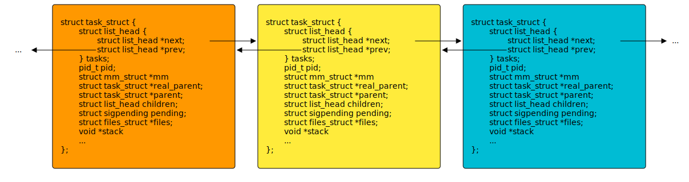

## Jak CFS przydziela czas procesora

Długości odcinków czasowych są wyliczane dynamicznie, na podstawie docelowego
opóźnienia (ang. target latency) i priorytetu procesu (niceness i priority),
dzięki czemu podział czasu procesora jest zawsze sprawiedliwy.

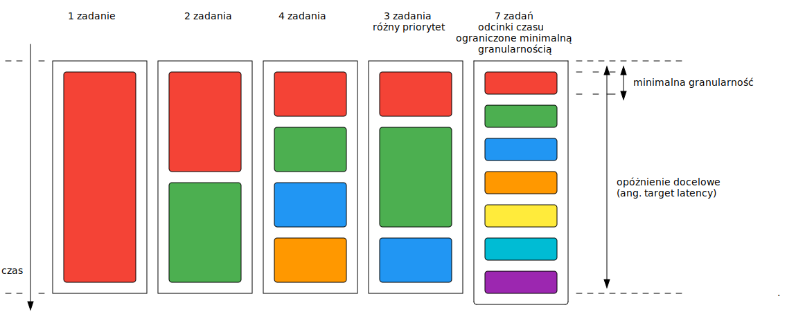

## Preemptive vs Cooperative multitasking

W przypadku preemptive multitasking planista może wywłaszczyć proces w dowolnym
momencie, w przypadku cooperative - tylko w wyznaczonym przez proces momencie.
**Planista w Linuksie implementuje preemptive multitasking.**

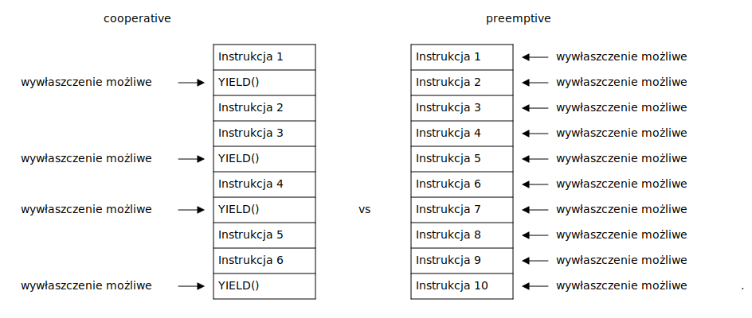

## Kiedy następuje wywłaszczenie

CFS może zaplanować wykonywanie innego procesu w momencie wystąpienia przerwania:

Czyli na przykład w momencie:

- naciśnięcia klawisza, odebrania pakietu sieciowego czy innego zdarzenia sprzętowego;
- przerwania pochodzącego od czasomierza systemowego (Programmable System Timer);
- wywołania systemowego (`open()`, `fork()`, `sleep()`, `write()`).

```c
int main(void)
{
    int x, w;
    x = 1;                               <---- tu może wystąpić przerwanie, możliwa zmiana procesu
    printf("%d\n", x);                   <---- wywołanie systemowe write(), możliwa zmiana procesu
    int fd = open("plik.txt", O_RDONLY); <---- wywołanie systemowe open(), możliwa zmiana procesu
    w = x + 1;                           <---- tu może wystąpić przerwanie, możliwa zmiana procesu
    int *g = malloc(sizeof(*g));         <---- malloc() nie jest wywołaniem systemowym ale
                                               może wywołać brk(), sbrk(), mmap(), które są,
                                               czyli możliwa zmiana procesu
}
```

# Wywołania systemowe

## Co jest efektem kompilacji?

Kod w języku C jest kompilowany do instrukcji maszynowych

```c
int foo(int a, int b)  _foo: 
{                      pushq %rbp            // Zapisz podstawe stosu
	int c = a + b;     movq  %rsp, %rbp      // Weź szczyt stosu jako podstawę
	return c;          movl  %edi, %eax      // Wrzuć pierwszy argument do %eax
}                      addl  %esi, %eax      // Dodaj drugi argument do %eax
                       movl  %eax, -4(%rbp)  // Wynik wrzuć na stos
                       movl  -4(%rbp), %eax  // Przekaż wartość zwracaną przez %eax
                       popq  %rbp            // Załaduj zapisaną podstawę stosu podstawę stosu
                       retq                  // Wróć z powrotem w miejsce wywołania  
```

## Instrukcje uprzywilejowane

Nie wszystkie instrukcje procesora są dostępne dla procesów użytkownika.
Procesy użytkownika nie mogą między innymi odczytywać pamięci chronionej, ani wykonywać niektórych instrukcji. Na przykład:

- `LGDT` - nadpisywanie tablicy przerwań;
- `IN`, `OUT` - obługa urządzeń wejścia/wyjścia;
- `MOV %eax, %cr3` - modyfikacja tablicy stron.

Procesy mogą jedynie "prosić" system operacyjny, żeby on w ich imieniu
wykonywał te instrukcje. Tą prośbą są **wywołania systemowe**.

## Wywołania systemowe

Wywołania systemowe, są przerwaniem programowym (ang. software interrupt)

1. Program wykonuje przerwanie (`syscall` lub `int 0x80`), w rejestrach ustawia
   odpowieni numer przerwania oraz przekazuje odpowiednie argumenty
2. System operacyjny zaczyna wykonywać procedurę obsługi tego przerwania:
   zapisuje stan procesora, przełącza stos programu na stos jądra (zmienia rejestr `%esp` - wskaźnik stosu), i wykonuje
   odpowiednią operację wskazaną numerem wywołania systemowego.
3. Po wykonaniu wywołania systemowego system operacyjny przywraca stan procesora (w tym stos procesu)
   i wznawiane jest wykonywanie programu.

```asm
message:
    .asciz "Hello world\n"
.set message_size, . - message
...
movl $1, %edi
leaq message(%rip), %rsi
movq $message_size, %rdx
movq $1, %rax             ;1 is sys_write syscall number
syscall
```

## Wywołania systemowe a funkcje

Biblioteka standardowa języka C (np. `glibc`, `musl` lub `uClibc`), implementuje
funkcje, które uruchamiają wywołania systemowe o podobnych nazwach.
Oprócz tego implementuje jeszcze dodatkową funkcjonalność oraz funkcje, które
nie są wywołaniami systemowymi.

Przykłady:

|  funkcja   | typ                                            |
|------------|------------------------------------------------|
| `open()`   | `syscall(SYS_open, ...)`                       |
| `fork()`   | `syscall(SYS_fork, ...)`                       |
| `write()`  | `syscall(SYS_write, ...)`                      |
| `read()`   | `syscall(SYS_read, ...)`                       |
| `printf()` | `syscall(SYS_write)` + dodatkowa funkcjonalność|
| `malloc()` | `syscall(SYS_brk)` + dodatkowa funkcjonalność  |
| `fopen()`  | `syscall(SYS_open)` + dodatkowa funkcjonalność |
| `strlen()` | funkcja biblioteczna                           |
| `memcpy()` | funkcja biblioteczna                           |

# Pamięć procesu

## Zmienne reprezentują komórki pamięci

Każda zmienna reprezentuje pewną komórkę pamięci.

```c
int y = 2; /* Zmienna w sekcji .data */

int main(void)
{
    int x; /* Zmienna na stosie */

    printf("%p\n", &x);
    printf("%p\n", &y);

    return 0;
}
```

## Pamięć wirtualna

Proces operuje na wirtualnych adresach pamięci, które są mapowane do
fizycznych adresów, przez tabele stron. Instruuje ona jednostkę zarządzania
pamięcią (ang. Memory Management Unit) w jaki sposób ma mapować pamięć.

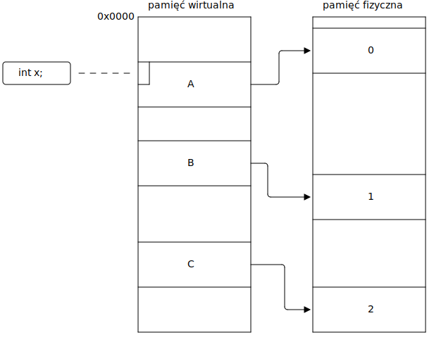

## Sekcje pamięci 

W systemie Linux skompilowany program będzie miał odpowiednią strukturę w pamięci:

```c
int x;  /* Niezainicjalizowane dane (.bss) */
int y = 3; /* Zainicjalizowane dane (.data) */
void foo(int x) /* Argumenty w rejestrach lub na stosie */     ---.
{                                                                 |
    static int x; /* Niezainicjalizowane dane (.bss) */           |
    static int y = 4; /* Zainicjalizowane dane (.data) */         |
}                                                                 |
int main(void)                                                    |    kod
{                                                                 |___ programu
    int x; /* Alokacja na stosie */                               |    umieszczany
    int *y = malloc(1024); /* Wskaźnik na stosie, */              |    w sekcji .text
                           /* a blok pamięci na stercie */        |
    foo(1); /* Adres powrotu na stosie,                           |
               argumenty w rejestrach lub na stosie  */           |
    return 0;                                                     |
}                                                              ---'

```

## Sekcje pamięci procesu

Pamięć procesu podzielona jest na sekcje, w których znajdują się "podobnego" rodzaju dane.


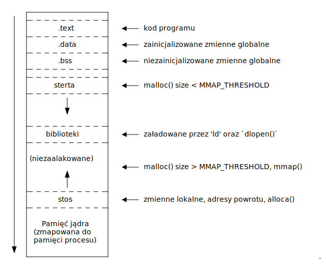

## Przykład sekcji pamięci - proces `yes`

```console
$ cat /proc/39299/maps
56148e969000-56148e96b000 r--p 00000000 08:05 24118661   /usr/bin/yes
56148e96b000-56148e96f000 r-xp 00002000 08:05 24118661   /usr/bin/yes
56148e96f000-56148e971000 r--p 00006000 08:05 24118661   /usr/bin/yes
56148e972000-56148e973000 r--p 00008000 08:05 24118661   /usr/bin/yes
56148e973000-56148e974000 rw-p 00009000 08:05 24118661   /usr/bin/yes
56148f694000-56148f6b5000 rw-p 00000000 00:00 0          [heap]
7f9f89876000-7f9f8a8cc000 r--p 00000000 08:05 24117276   /usr/lib/locale/locale-archive
7f9f8a8cc000-7f9f8a8ee000 r--p 00000000 08:05 24122481   /usr/lib/x86_64-linux-gnu/libc-2.31.so
7f9f8a8ee000-7f9f8aa66000 r-xp 00022000 08:05 24122481   /usr/lib/x86_64-linux-gnu/libc-2.31.so
7f9f8aa66000-7f9f8aab4000 r--p 0019a000 08:05 24122481   /usr/lib/x86_64-linux-gnu/libc-2.31.so
7f9f8aab4000-7f9f8aab8000 r--p 001e7000 08:05 24122481   /usr/lib/x86_64-linux-gnu/libc-2.31.so
7f9f8aab8000-7f9f8aaba000 rw-p 001eb000 08:05 24122481   /usr/lib/x86_64-linux-gnu/libc-2.31.so
7f9f8aaba000-7f9f8aac0000 rw-p 00000000 00:00 0
7f9f8aae0000-7f9f8aae1000 r--p 00000000 08:05 24122477   /usr/lib/x86_64-linux-gnu/ld-2.31.so
7f9f8aae1000-7f9f8ab04000 r-xp 00001000 08:05 24122477   /usr/lib/x86_64-linux-gnu/ld-2.31.so
7f9f8ab04000-7f9f8ab0c000 r--p 00024000 08:05 24122477   /usr/lib/x86_64-linux-gnu/ld-2.31.so
7f9f8ab0d000-7f9f8ab0e000 r--p 0002c000 08:05 24122477   /usr/lib/x86_64-linux-gnu/ld-2.31.so
7f9f8ab0e000-7f9f8ab0f000 rw-p 0002d000 08:05 24122477   /usr/lib/x86_64-linux-gnu/ld-2.31.so
7f9f8ab0f000-7f9f8ab10000 rw-p 00000000 00:00 0
7ffe6a478000-7ffe6a499000 rw-p 00000000 00:00 0          [stack]
7ffe6a5cb000-7ffe6a5cf000 r--p 00000000 00:00 0          [vvar]
7ffe6a5cf000-7ffe6a5d1000 r-xp 00000000 00:00 0          [vdso]
ffffffffff600000-ffffffffff601000 --xp 00000000 00:00 0  [vsyscall]
```

## Address space layout randomization

Adresy sekcji są losowe, aby utrudnić manipulacje na pamięci atakującemu.

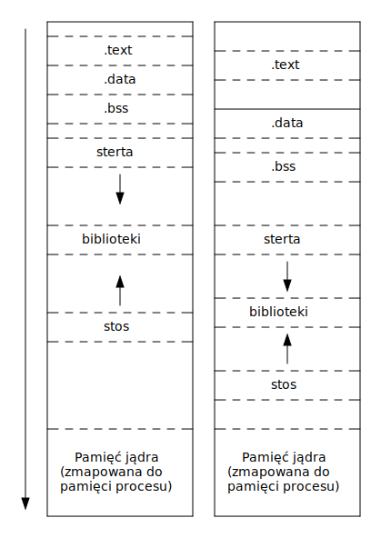

## KASLR

Jądro jest mapowane pod losowym adresem

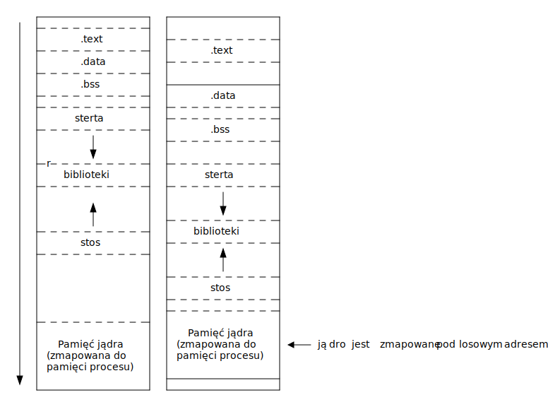

## KAISER

Mapowana jest tylko niezbędna część jądra. Po przełączeniu się w tryb jądra (przy wywołaniach systemowych)
przełączana jest pełna tabela stron z całym jądrem (zmiana rejestru CR3).

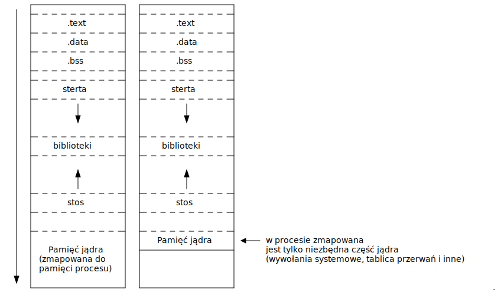

## Copy-on-write

Strony pamięci wirtualnej nowego procesu oznaczone są jako tylko do odczytu.
Próba nadpisania skutkuje wyjątkiem Page Fault, którego obsługa pozwala systemowi
operacyjnemu skopiować stronę

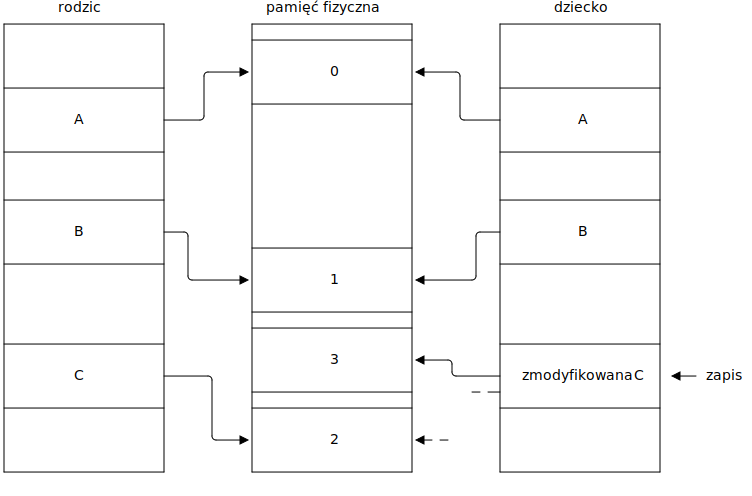

# Dziękuję za uwagę

## Dalsza lektura

- **Książki**
    - Love Robert. 2010. Linux Kernel Development. Pearson Education.
    - Love Robert. 2013. Linux System Programming. O'REILLY.
    - Stevens Richard W., Rago Stephen A., Advanced Programming in the UNIX® Environment, Third Edition. Addison-Wesley.
- **Artykuły**
    - https://lwn.net/Articles/738975/
    - https://samwho.dev/blog/context-switching-on-x86/
- **Manual**
    - `man 2 fork`
    - `man 2 wait`
    - `man 3 exec`
