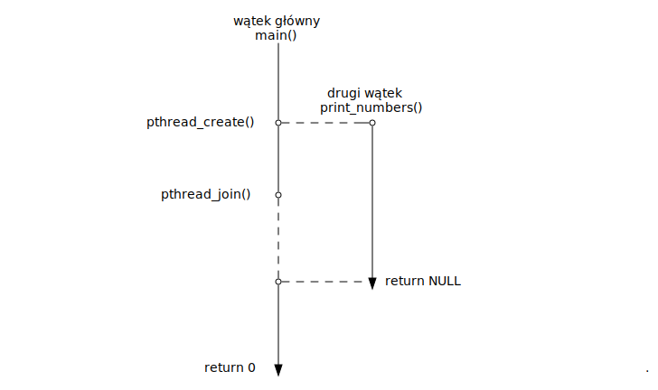
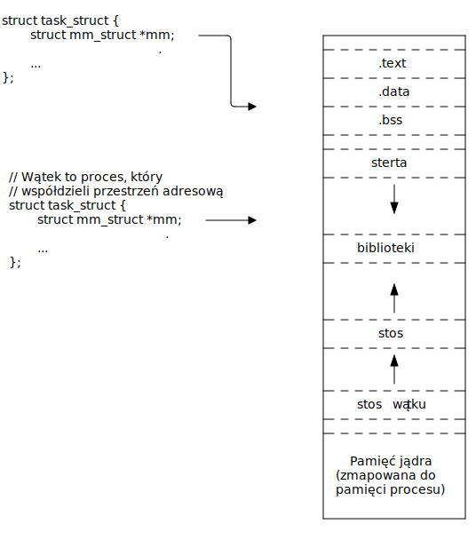

# Zagadnienie 2: Wątki i synchronizacja

## Informacje wstępne - funkcja

Funkcje w języku C, to takie "podprogramy", które realizują pewną funkcjonalność.

Definicja funkcji:
```c
float add(float a, float b)
{
    float result = a + b;

    return result;
}
```

Wywołanie funkcji:

```c
float res = add(1.0f, 2.0f);
printf("%f", res);

/* Oczywiście nic nie stoi na przeszkodzie, żeby zignorować
   wartość zwracaną */
add(3.0f, 11.0f);
```

## Informacje wstępne - funkcja, która nie zwraca wartości

```c
void introduce(const char *name, const char *surname)
{
    printf("Hi! I am %s %s\n", name, surname);
}
```

Wywołanie:

```c
introduce("Jan", "Kowalski");
```

## Informacje wstępne - wskaźniki

Wskaźnik to zmienna, która może zawierać adres do innej zmiennej. Przykład:

```c
int age = 20; /* zmienna */
int *age_pointer = &age; /* wskaźnik pokazujący do zmiennej */
```

Za pomocą takiego wskaźnika możemy następnie modyfikować oraz odczytywać wartość
zmiennej:

```c
int age = 20; /* zmienna */
int *age_pointer = &age; /* wskaźnik pokazujący do zmiennej */

*age_pointer = 80;
printf("%d", age);
printf("%d", *age_pointer);

age = 15;

printf("%d", age);
printf("%d", *age_pointer);
```

## Informacje wstępne - wskaźnik 0

Ustawiając wskaźnik na wartość `NULL`, sprawiamy, że będzie on przechowywał adres
zerowy

```c
int *x = NULL;
int *y;
y = NULL;

/* Dereferencja takich wskaźników najprawdopodobniej skończy się naruszeniem
   ochrony pamięci (Segmentation fault) */
int liczba = *x; /* Problem */
```

## Informacje wstępne - wskaźnik `void *`

Pomimo tego że rozmiary zmiennych wskaźnikowych są zawsze takie same, nie powinno
się mieszać typów:

```c
int x = 1;
float *y = &x; /* Ostrzeżenie przy kompilacji */
printf("%f", *y); /* Niezdefiniowane zachowanie (ang. Undefined behavior) */
```

Wskaźnik `void *`, jest wyjątkiem. Może on przechowywać adres do zmiennej
dowolnego typu.
```c
int x = 1;
float y = 1.0f;
int *z = &x;
void *ptr = &x; /* Można mu przypisać dowolny adres */
ptr = z; /* Można mu przypisać dowolny wskaźnik */
ptr = &y;
float *py = ptr; /* Można go przypisywać do wskaźnika innego typu */
```

Nie można wykonać dereferencji na wskaźniku `void`. Czyli `*ptr`, nie działa.
Trzeba go przypisać do konkretnego typu i dopiero potem wykonać dereferencje.


## Informacje wstępne - przekazywanie zmiennych do funkcji przez wskaźnik a przez wartość

Przykład - funkcja która zwiększa wartość zmiennej o 1:

```c
void increment(int *x)              void increment(int x)
{                                   {
    *x = *x + 1;                        x = x + 1;
}                                   }
```

Wywołanie:
```c
int x = 17;                         int x = 17;

increment(&x);                      increment(x);
increment(&x);                      increment(x);
increment(&x);                      increment(x);

printf("%d\n", x);                  printf("%d\n", x);
```

Jaka jest różnica?

## Informacje wstępne - wskaźniki na funkcje

Możemy stworzyć zmienną, która będzie przechowywać adres funkcji:

```c
int add(int x, int y)
{
    return x + y;
}

int main(void)
{
    /* Tworzymy wskaźnik na funkcję o nazwie 'operation' i przypisujemy
       my adres funkcji add. Nie musimy stosować & */
    int (*operation)(int a, int b) = add;

    int result = operation(1, 2);

    printf("%d\n", result);
}
```

## Po co nam wskaźniki na funkcję?

Wskaźniki na funkcję są przydatne jeżeli chcemy zmienić zachowanie kodu minimalnie w niego ingerując
lub zmienić zachowanie kodu w trakcie działania.

```c
int add(int x, int y)
{
    return x + y;
}

int sub(int x, int y)
{
    return x - y;
}

int main(void)
{
    /* Wystarczy przypisać inną wartość, a zmienia się działanie programu */
    int (*operation)(int a, int b) = sub;

    int result = operation(1, 2);

    printf("%d\n", result);
}
```

## Wątki POSIX

Wątki POSIX (ang. POSIX threads) to zestaw funkcji służących między innymi do

- Tworzenia wątków
- Synchronizacji wątków za pomocą mutexów
- Synchronizacji wątków za pomocą zmiennych warunkowych (ang. conditional variables)

**Po co nam wątki?**

- Do przyśpieszania obliczeń poprzez ich zrównoleglenie.
- Do zwiększenia interaktywności aplikacji, poprzez wykonywanie niektórych obliczeń "w tle".

## Kompilacja programu używającego POSIX threads

Program który używa biblioteki POSIX threads, należy zlinkować z biblioteką
`libpthread.so`. Można to osiągnąć używając przełącznika `-l` do kompilatora 
`gcc`.

```bash
$ gcc -lpthread twojprogram.c
```

## Funkcja wątku

W celu utworzenia nowego wątku, należy najpierw napisać funkcję, która będzie
wykonywana przez wątek. Jej sygnatura musi być następująca:

```c
void *thread_function(void *arg);
```

Przykład - funkcja wątku, która wypisuje liczby od 1 do 10:
```c
void *print_numbers(void *arg)
{
    for (unsigned int i = 0; i < 10; ++i)
        printf("%d\n");

    return NULL;
}
```

## Tworzenie wątków

Nowy wątek można utworzyć za pomocą funkcji `pthread_create()`. Jako
argument należy jej przekazać funkcję wątku.

```c
/**
 * @thread: wskaźnik do zmiennej w której zostanie zapisany 'uchwyt' do wątku
 * @attr: atrybuty wątku (można przekazać NULL i narazie o tym nie myśleć)
 * @start_routine: funkcja wątku
 * @arg: argument do funkcji wątku
 */
int pthread_create(pthread_t *thread, const pthread_attr_t *attr,
                   void *(*start_routine)(void *), void *arg);
```

Przykład - utworzenie nowego wątku, który będzie wykonywał funkcję
`print_numbers()`:

```c
pthread_t thread;
int err = pthread_create(&thread, NULL, print_numbers, NULL);
if (err)
    return 1;
```

## Łączenie wątku

Po utworzeniu nowego wątku, rozpocznie się jego wykonywanie. Przed zakończeniem
programu powinniśmy poczekać na zakończenie wątku za pomocą funkcji
`pthread_join()`.

```c
err = pthread_join(&thread);
if (err)
    return 1;
```

Funkcja `pthread_join()` blokuje wątek, w którym została wywołana do momentu
zakończenia wątku na który oczekujemy.

## Kompletny przykład

```c
#include <pthread.h>

void *print_numbers(void *arg)
{
    for (unsigned int i = 0; i < 10; ++i)
        printf("%d\n");

    return NULL;
}

int main(void)
{
    pthread_t thread;
    int err = pthread_create(&thread, NULL, print_numbers, NULL);
    if (err)
        return 1;

    /* W tym momencie w "tle" wykonywana jest funkcja 'print_numbers' */

    err = pthread_join(thread, NULL);
    if (err)
        return 1;
    return 0;
}
```

## Przebieg

Wątki wykonują się równolegle. Rysunek przedstawia przebieg wykonywania się wątków
w czasie:



## Wątek vs proces - praktyczna róznica

Wątki wspóldzielą przestrzeń adresową
```c
x = 0
...
// wątek 1                  // wątek 2
x += 1;                     
                            x += 1;
printf("%d\n", x); // 2
                            printf("%d\n", x); // 2
```
Procesy współdzielą przestrzeń adresową do pierwszego zapisu
```c
x = 0;
...
// proces 1                 // proces 2
x += 1; // Copy-on-write                    
                            x += 1;
printf("%d\n", x); // 1          
                            printf("%d\n", x); // 1
```

## Wątek vs proces - współdzielenie przestrzeni adresowej



## Przekazywanie argumentów do funkcji wątku

Funkcja wątku przyjmuje jako pierwszy argument wskaźnik, przez który
można jej przekazać dowolną wartość.

```c
void *print_numbers(void *arg)
{
    int *start = arg;

    /* Wypisanie liczb od *start do *start + 10 */
    for (unsigned int i = *start; i < *start + 10; ++i)
        printf("%d\n");

    return NULL;
}
```

Wskaźnik do argumentu należy przekazać jako argument do funkcji `pthread_create()`.

```c
int first_number = 1000;
int err = pthread_create(&threads[i], NULL, print_numbers, &first_number);
if (err) {
    /* Obsługa błędu */
}
```

## Przykład: sumowanie liczb w wielu wątkach - funkcja wątku

Możemy utworzyć wiele wątków wywołując kilka razy funkcję `pthread_create()`.
Dla przykładu stwórzmy program który będzie sumował liczby w tablicy, wykorzystując
`4` wątki.

```c
/* Zmienna globalna zawierająca liczby do zsumowania */
int data[16] = { 0, 2, 4, 5, 0, 1, 4, 9, 0, 2, 1, 5, 0, 3, 4, 1 };
/* Zmienna globalna zwiarająca wyniki sumowania dla każdego wątku */
int result[4];

void *sum(void *arg)
{
    int *thread_nr = *arg;
    int offset = *thread_nr * 4;

    for (int i = offset; i < offset + 4; ++i)
        result[i] += data[i];

    return NULL;
}
```

## Przykład sumowanie liczb w wielu wątkach - funkcja main

```c
int main(void)
{
    pthread_t threads[4];
    int thread_numbers[4] = {0, 1, 2, 3}

    for (int i = 0; i < 4; ++i) {
        int error = pthread_create(&threads[i], NULL, sum, &thread_numbers[i]);
        if (error)
            return 1;
    }

    /* W tym momencie wątki sumują liczby */

    for (int i = 0; i < 4; ++i) {
        int err = pthread_join(threads[i], NULL);
        if (err)
            printf("join failed\n");
    }

    printf("%d", result[0] + result[1] + result[2] + result[3]);
}
```

# Mutexy

## Sekcja krytyczna

Sekcja krytyczna to fragment kodu, który korzysta z zasobu współdzielonego
przez inny wątek lub wątki.

```c
int values[32];
int num_values;

void *thread_1(void *arg)
{
	for (int i = 0; i < 16; ++i) {	 	
		/* Sekcja krytyczna */
		values[num_values] = i;
		num_values++;
	}
	return NULL;
}
void *thread_2(void *arg)
{
	for (int i = 0; i < 16; ++i) {
		/* Sekcja krytyczna */
		values[num_values++] = -i;
	}
	return NULL;
}
```

## 2 wątki - ten sam kod

```c
int values[32];
int num_values;

void *thread_fn(void *arg)
{
	for (int i = 0; i < 16; ++i) {	 	
		/* Sekcja krytyczna */
		values[num_values] = i;
		num_values++;
	}
	return NULL;
}

int main(void)
{
	pthread_t thread1, thread2;
	int err = pthread_create(&thread1, NULL, &thread, NULL);
	if (err)
		return 1;
	err = pthread_create(&thread2, NULL, &thread, NULL);
	if (err)
		return 1;
}
```

## Synchronizacja

W danym momencie do współdzielonego zasobu powinien mieć dostęp tylko jeden
wątek. Oznacza to, że jeżeli jeden wątek korzysta ze współdzielonego
zasobu, to drugi powinien zaczekać, aż ten pierwszy skończy.

Do takiej synchronizacji wykorzystywane są mutexy (od ang. Mutual Exclusion). Poniżej przedstawiono przykład
tworzenia mutexu.

```c
pthread_mutex_t lock;

int main(void)
{
	/* Inicjalizacja mutexu */
	int ret = pthread_mutex_init(&lock, NULL);
	if (ret)
		return 1;
	...
	/* Deinicjalizacja mutexu */
	pthread_mutex_destroy(&lock, NULL);
	return 0;
}
```

## Blokowanie mutexów

```c
--> pthread_mutex_lock(&lock);          --> pthread_mutex_lock(&lock);
    values[num_values] = i;                 values[num_values] = i;
    num_values++;                           num_values++;
    pthread_mutex_unlock(&lock);            pthread_mutex_unlock(&lock);
```
```c
    pthread_mutex_lock(&lock);          --> pthread_mutex_lock(&lock);
--> values[num_values] = i;                 values[num_values] = i;
    num_values++;                           num_values++;
    pthread_mutex_unlock(&lock);            pthread_mutex_unlock(&lock);
```
```c
    pthread_mutex_lock(&lock);          --> pthread_mutex_lock(&lock);
    values[num_values] = i;                 values[num_values] = i;
    num_values++;                           num_values++;
--> pthread_mutex_unlock(&lock);            pthread_mutex_unlock(&lock);
```
```c
    pthread_mutex_lock(&lock);              pthread_mutex_lock(&lock);
    values[num_values] = i;             --> values[num_values] = i;
    num_values++;                           num_values++;
    pthread_mutex_unlock(&lock);            pthread_mutex_unlock(&lock);
```

## Blokowanie mutexów - przykład

```c
int values[32];
int num_values;
pthread_mutex_t lock;

void *thread_1(void *arg)
{
	for (int i = 0; i < 16; ++i) {	 	
		pthread_mutex_lock(&lock);
		values[num_values] = i;
		num_values++;
		pthread_mutex_unlock(&lock);
	}
	return NULL;
}
void *thread_2(void *arg)
{
	for (int i = 0; i < 16; ++i) {
		pthread_mutex_lock(&lock);
		values[num_values++] = -i;
		pthread_mutex_unlock(&lock);
	}
	return NULL;
}
```

## Blokowanie mutexów - przykład 2

```c
int values[32];
int num_values;
pthread_mutex_t lock;

void *thread_fn(void *arg)
{
	for (int i = 0; i < 16; ++i) {	 	
		/* Sekcja krytyczna */
		pthread_mutex_lock(&lock);
		values[num_values] = i;
		num_values++;
		pthread_mutex_unlock(&lock);
	}
	return NULL;
}
int main(void)
{
	pthread_t thread1, thread2;
	int err = pthread_create(&thread1, NULL, &thread, NULL);
	...
	err = pthread_create(&thread2, NULL, &thread, NULL);
	...
}
```

## Deadlock

Jednym z przypadków kiedy może wystąpić deadlock jest gdy jeden z wątków nie
zwolni mutexu.

```c
pthread_mutex_t lock;
void *thread_1(void *arg)
{
	for (int i = 0; i < 16; ++i) {	 	
		pthread_mutex_lock(&lock);
		values[num_values++] = i;
		pthread_mutex_unlock(&lock);
	}
	return NULL;
}
void *thread_2(void *arg)
{
	for (int i = 0; i < 16; ++i) {
		pthread_mutex_lock(&lock);
		values[num_values++] = -i;
		if (i == 5)
			break;
		pthread_mutex_unlock(&lock);
	}
	return NULL;
}
```

## Deadlock - przykład 2

```c
pthread_mutex_t lock_a, lock_b;
void *thread_1(void *arg)
{
	pthread_mutex_lock(&lock_a);       
	...
	pthread_mutex_lock(&lock_b); /* Nie możemy wejść bo thread_2 trzyma lock_b */
	...
	pthread_mutex_unlock(&lock_b);
	...
	pthread_mutex_unlock(&lock_a);
	return NULL;
}
void *thread_2(void *arg)
{
	pthread_mutex_lock(&lock_b);
	...
	pthread_mutex_lock(&lock_a); /* Nie możemy wejść bo thread_1 trzyma lock_a */
	...
	pthread_mutex_unlock(&lock_a);
	...
	pthread_mutex_unlock(&lock_b);
	return NULL;
}
```

# Dziękuję za uwagę
