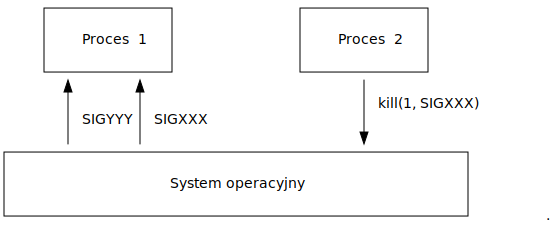
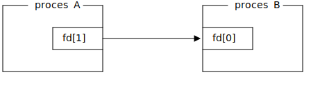
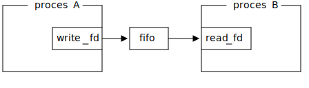
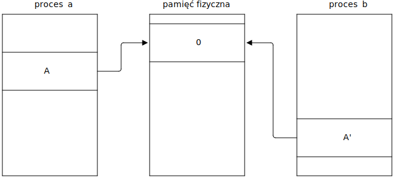
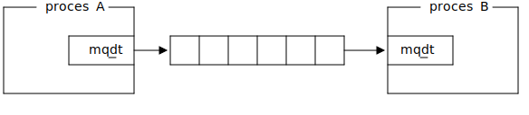

# Zagadnienie 4: Komunikacja międzyprocesowa

## Do czego służy komunikacja międzyprocesowa

Procesy w przeciwieństwie do wątków posiadają odrębną przestrzeń adresową, czyli
nie współdzielą pamięci. Dzięki temu nie przeszkadzają sobie nawzajem podczas
wykonywania. Jednak czasem zachodzi potrzeba skomunikowania dwóch procesów. Służą
do tego narzędzia komunikacji międzyprocesowej (ang. inter-process communication, IPC).
Są to:

- sygnały
- potoki nienazwane
- potoki nazwane
- pamięć współdzielona
- semafory
- kolejki komunikatów
- gniazda

# Sygnały

## Sygnały

Sygnały to przerwania programowe, które system operacyjny wywołuje w celu
powiadomienia procesów o zdarzeniach. Można je zaliczyć do komunikacji
międzyprocesowej, ponieważ mogą zostać zainicjowane przez inny proces.



## Przykładowe sygnały i domyślne reakcje

| Sygnał  | Zdarzenie | Domyślna akcja | 
| :--     | :-- | :-- |
| SIGABRT  | Wysłane przez `abort()` | Zakończ proces |
| SIGARLM  | Wysłane przez `alarm()` | Zakończ proces |
| SIGCHLD  | Proces potomny się zakończył | Zignoruj |
| SIGINT   | Użytkownik wysłał znak `Ctrl-C` | Zakończ proces |
| SIGQUIT  | Użytkownik wysłał znak `Ctrl-\` | Zakończ proces |
| SIGKILL  | Nieprzechwytywalne zakończenie procesu | Zakończ proces |
| SIGTERM  | Zakończenie procesu | Zakończ proces |
| SIGSTOP  | Wymuszenie zatrzymania procesu | Zatrzymaj proces |
| SIGCONT  | Proces został kontynuowany | Zignoruj |
| SIGPIPE  | Zapis do potoku, którego nikt nie czyta | Zakończ proces |
| SIGHUP   | Zamknięto terminal kontrolujący proces | Zakończ proces |
| SIGSEGV  | Nieprawidłowy dostęp do pamięci | Zakończ proces |
| SIGUSR1  | Zdarzenie 1 ogólnego przeznaczenia | Zakończ proces |
| SIGUSR2  | Zdarzenie 2 ogólnego przeznaczenia | Zakończ proces |
| SIGWINCH | Terminal kontrolujący zmienił rozmiar | Zignoruj |
| SIGILL   | Procej wykonał nieprawidłową instrukcję | Zakończ proces |

## Wysyłanie sygnałów do procesów

Do wysyłania sygnałów do procesów, służy wywołanie systemowe `kill()`.

```c
#include <signal.h>

int kill(pid_t pid, int sig);
```

Przykład: wysłanie signału `SIGTERM` do procesu o numerze PID `1024`:

```c
int err = kill(1024, SIGTERM);
if (err) {
    /* obsługa błędów */
}
```

## Własne procedury obsługi sygnałów

Domyślne zachowanie na odebrany sygnał (za wyjątkiem `SIGKILL` i `SIGSTOP`)
można nadpisać używając wywołania systemowego `sigaction()`.

```c
#include <signal.h>

struct sigaction {
    void (*sa_handler)(int);
    void (*sa_sigaction)(int, siginfo_t *, void *);
    sigset_t sa_mask;
    int sa_flags;
    void (*sa_restorer)(void);
};

int sigaction(int signum, const struct sigaction *restrict act, struct sigaction *restrict oldact);
```

## Własne procedury obsługi sygnałów - przykład

Zamiast natychmiastowego zakończenia, ustawiana jest flaga przerywająca główną pętlę programu.

```c
#include <signal.h>
#include <stdio.h>
#include <unistd.h>

volatile sig_atomic_t flag;
void signal_handler(int signal)
{
    flag = 1;
}
const struct sigaction act = {
    .sa_handler = signal_handler,
};

int main(void)
{
    if (sigaction(SIGINT, &act, NULL))
        return 1;

    while (!flag) {
        /* ... */
        sleep(1);
    }
    printf("shutting down...\n");
    return 0;
}
```

## Wymagania jakie musi spełniać procedura obsługi sygnału

W procedurze obsługi sygnału można wywoływać tylko funkcje, które są _wielobieżne_ (ang. re-entrant).
Przykładem funkcji wielobieżnej jest:
```c
int add(int a, int b)
{
    return a + b;
}
```

Przykład funkcji, która nie jest wielobieżna:
```c
int numbers[64], numbers_count = 0
void append(int x)
{
    numbers[numbers_count] = x;
                    // <----- jeżeli wystąpi sygnał i append() zostanie wywołane to będzie niespójnosć.
    numbers_count = (numbers_count + 1) % 64;
}
```
Wywoływanie funkcji nie będącą wielobieżną czyni, wywołującą ja funkcję też funkcją nie wielobieżną.

## Bezpieczne funkcje w obsłudze sygnałów

Standard POSIX określa, które funkcje z biblioteki standardowej można bezpiecznie wywoływać w procedurze
obsługi sygnałów. Funkcje te oznaczone są jako _async-signal-safe_ (`man signal-safety`):

- _async-signal-safe_ są na przykład: `read()`, `write()`, `open()`, `fork()`;
- niebezpieczne są na przykład: `malloc()`, `free()`, `printf()`, `pthread_mutex_lock()`.

Dodatkowo dostęp do jakichkolwiek zmiennych z _static storage duration_ (czyli w praktyce wszelkich zmiennych globalnych)
innych niż typu `volatile sig_atomic_t` jest niezdefiniowanym zachowaniem.

Z tego powodu najbezpieczniej jest ograniczyc procedure obsługi sygnału tylko do ustawienia flagi.

```c
volatile sig_atomic_t flag;

void signal_handler(int signal)
{
    flag = 1;
}
```

## Synchroniczna obsługa sygnałów w osobnym wątku

Z powodu bardzo dużych ograniczeń dotyczących procedur obsługi sygnałów, lepszym
rozwiązaniem może się okazać synchroniczna obsługa sygnałów w dedykowanym wątku.

```c
pthread_mutex_lock lock = PTHREAD_MUTEX_INITIALIZER;
int flag;

void *signal_thread(void *arg)
{
	const sigset_t *set = arg;

	while (1) {
		int signal_number;
		if (sigwait(set, &signal_number))
			continue;
        if (!sigismember(set, signal_number))
            continue;

        pthread_mutex_lock(&lock);
        flag = 1;
        pthread_mutex_unlock(&lock);
	}
	return NULL;
}
```

## Synchroniczna obsługa sygnałów - maskowanie sygnałów

Zamaskowany sygnał będzie oczekiwał do momentu wywołania `sigwait()`.

```c
int main(int argc, char **argv)
{
	sigset_t set;
	sigemptyset(&set);
	sigaddset(&set, SIGINT);
	if (sigprocmask(SIG_SETMASK, &set, NULL))
		return 1;
	pthread_t thread;
	if (pthread_create(&thread, NULL, signal_thread, &set))
		return 1;

    int stop = 0;
    while (!stop) {
        /* ... */
        pthread_mutex_lock(&lock);
        stop = flag;
        pthread_mutex_unlock(&lock);
    }
	pthread_cancel(thread);
	pthread_join(thread, NULL);
	return 0;
}
```

# Potoki nienazwane

## Potoki nienazwane

Potoki nienazwane pozwalają na jednostronne przesyłanie danych pomiędzy
procesami.



Strona podręcznika: `man 7 pipe`.

## Potoki nienazwane - tworzenie

Tworzenie potoku nienazwanego odbywa się za pomocą wywołania systemowego `pipe()`.

```c
#include <unistd.h>

int pipe(int fd[2]);
```

Utworzyć potok można w następujący sposób:

```c
int fd[2];
int err = pipe(fd);
if (err) {
    /* obsługa błędów */
}
```

Po wywołaniu, desktyptor `fd[0]` będzie służył do odczytywania danych z potoku,
natomiast `fd[1]` będzie służył do wpisywania danych do potoku.

## Potoki nienazwane - zapis

Do zapisu danych do potoku służy wywołanie systemowe `write()`.
```c
#include <unistd.h>

ssize_t write(int fd, const void *buf, size_t count);
```

```c
ssize_t num_written = write(fd[1], "hello", 5);
if (num_written <= 0) {
    /* obsługa błędu */
}
if (num_written != 5) {
    /* częściowy zapis */
}
```
Zapisanie danych do potoku powoduje zablokowanie procesu jeżeli potok
jest pełny (o ile nie jest ustawiona flaga `O_NONBLOCK` (`man fcntl`)).

Zapisanie danych do potoku, którego druga strona została zamknięta powoduje
wystąpienie sygnału `SIGPIPE`.

## Potoki nienazwane - odczyt

Do odczytu danych do potoku służy wywołanie systemowe `read()`.
```c
#include <unistd.h>

ssize_t read(int fd, void *buf, size_t count);
```

```c
char buf[6] = {0}
ssize_t num_read = read(fd[1], buf, 5);
if (num_read < 0) {
    /* obsługa błędu */
}
if (num_read == 0) {
    /* druga strona została zamknięta */
}
if (num_read != 5) {
    /* częściowy odczyt */
}
```
Odczytanie danych z potoku powoduje zablokowanie procesu jeżeli potok
jest pusty (o ile nie jest ustawiona flaga `O_NONBLOCK` (`man fcntl`)).

Odczytanie danych z potoku, którego druga strona została zamknięta powoduje
zwrócenie `0`.


## Potoki nienazwane - przykład

```c
int main(void)
{
    int fd[2];
    if (pipe(fd))
        return 1;

    pid_t pid = fork();
    if (pid == 0) {
        close(fd[0]);                                  /* zamknięcie deskryptora do odczytu */
        write(fd[1], "Hello world", 11);               /* wysłanie wiadomości */
        close(fd[1]);                                  /* zamknięcie deskryptora do zapisu */
        return 0;
    } else if (pid < 0) {
        close(fd[0]);
        close(fd[1]);
        return 1;
    }
    close(fd[1]);                                      /* zamknięcie deskryptora do zapisu */

    char b[256] = {0};
    ssize_t num_read = read(fd[0], b, sizeof(b) - 1);  /* odebranie wiadomości */
    if (num_read > 0)
        printf("%s", b);

    close(fd[0]);                                      /* zamknięcie deskryptora do odczytu */
    wait(NULL);
}

```

## Potoki nienazwane - przykład 2

```c
int main(void)
{
    if (pipe(fd))
        return 1;
    pid_t pid = fork();
    if (pid == 0) {
        close(fd[1]);
        if (dup2(fd[0], 0)) {
            close(fd[0]);
            return 1;
        }
        return execlp("sort", "sort", NULL) ? 1 : 1;
    }
    pid = fork();
    if (pid == 0) {
        close(fd[0]);
        if (dup2(fd[1], 1)) {
            close(fd[1]);
            return 1;
        }
        return execlp("ls", "ls", NULL) ? 1 : 1;
    }
    close(fd[0]);
    close(fd[1]);
    wait(NULL);
    wait(NULL);
}
```

# Potoki nazwane

## Potoki nazwane

Potoki nazwane pozwalają na jednostronne przesyłanie danych pomiędzy
procesami. W przeciwieństwie do potoków nienazwanych, przesyłanie danych
możliwe jest pomiędzy dowolnymi procesami, a nie tylko tymi które odziedziczyły
deskryptory potoku po procesie rodzica, ponieważ potoki nazwane mają swoją
reprezentację w systemie plików.



## Potoki nazwane - tworzenie

Do tworzenia potoku nazwanego służy wywołanie systemowe `mkfifo()`.

```c
#include <sys/types.h>
#include <sys/stat.h>

int mkfifo(const char *path, mode_t mode);
```

Przykład:

```c
#include <sys/types.h>
#include <sys/stat.h>

int main(void)
{
    return mkfifo("foo", 0777) ? 0 : 1;
}
```

Można też wykorzystać narzędzie `mkfifo`.
```
$ mkfifo foo
```

## Potoki nazwane - odczyt

Poniższy program odczyta dane z potoku o nazwie `foo`.

```c
#include <fcntl.h>
#include <unistd.h>

int main(void)
{
    int read_fd = open("foo", O_RDONLY);
    if (read_fd < 0)
        return 1;

    char message[64] = {0};

    ssize_t num_read = read(read_fd, message, sizeof(message) - 1);
    if (num_read > 0)
        printf("%s", message);

    close(read_fd);

    return 0;
}
```

## Potoki nazwane - zapis

Poniższy program wpisze dane do potoku o nazwie `foo`.

```c
#include <fcntl.h>
#include <unistd.h>
#include <string.h>

int main(void)
{
    int read_fd = open("foo", O_WRONLY);
    if (read_fd < 0)
        return 1;

    char message[64] = "Hello world";
    size_t len = strlen(message);

    ssize_t num_written = write(write_fd, message, len);
    if (num_read != (ssize_t)len)
        return 1;

    close(write_fd);

    return 0;
}
```


# Pamięć współdzielona

## Pamięć współdzielona - wywołania systemowe

Mechanizm pamięci współdzielonej pozwala na podmapowanie strony pamieci wirtualnej odnoszącej się do tej samej pamięci fizycznej.



Strona podręcznika: `man shm_overview`

## Pamięć współdzielona

Do tworzenia, zamykania i usuwania pamięci wspóldzielonej służą wywołania systemowe `shm_open()`, `close()`, `shm_unlink()`.

```c
#include <sys/mman.h>
#include <fcntl.h>

int shm_open(const char *name, int oflag, ...);
int shm_unlink(const char *name);
int close(int fd);
```

Do mapowania i odmapowywania pamięci współdzielonej służą wywołania systemowe `mmap()` i `munmap()`.
```c
#include <sys/mman.h>

void *mmap(void *addr, size_t len, int prot, int flags, int fd, off_t offset);
int munmap(void *addr, size_t len);
```

## Pamięć współdzielona - współdzielenie danych

Pamięć współdzielona to po prostu blok pamięci o zadanym rozmiarze. Interpretacja
tego bloku pamięci zależy od programisty. Możemy na przykład zinterpretować go jako następującą strukturę:

```c
struct data {
	char message[32];
    int x;
};
```
```c
struct data *data = mmap(NULL, sizeof(*data), PROT_READ | PROT_WRITE, MAP_SHARED, fd, 0);
if (data == MAP_FAILED) {
    /* obsługa błędu */
}
```

Uwaga! współdzielenie wskaźników pokazujących do zmiennych w pamięci współdzielonej
nie zadziała ponieważ pamięć współdzielona może zostać podmapowana pod różne adresy wirtualne.

```c
struct x {
    int *a; // przechowywanie tutaj adresu b, nie będzie mialo sensu w innym procesie */
    int b;  // ponieważ b będzie miało inny adres wirtualny w innym procesie
}
```

## Pamięć współdzielona - proces 1

Poniższy przykład pokazuje odczytywanie wiadomości umieszczonej w pamięci współdzielonej:

```c
int fd = shm_open("/mem", O_CREAT | O_RDWR, 0666);
if (fd < 0) {
    /* obsługa błędu */
}
if (ftruncate(fd, sizeof(struct data))) {
    /* obsługa błędu */
}

struct data *data = mmap(NULL, sizeof(*data), PROT_READ | PROT_WRITE, MAP_SHARED, fd, 0);
if (data == MAP_FAILED) {
    /* obsługa błędu */
}

while (1) {
    printf("%s\n", data->message);
    sleep(1);
}

if (close(fd)) {
    /* obsługa błędu */
}
if (shm_unlink("/mem")) {
    /* obsługa błędu */
}
```

## Pamięć współdzielona - proces 2

Poniższy przykład pokazuje zapisywanie wiadomości umieszczonej w pamięci współdzielonej:

```c
int fd = shm_open("/mem", O_RDWR, 0666);
if (fd < 0) {
    /* obsługa błędu */
}

struct data *data = mmap(NULL, sizeof(*data), PROT_READ | PROT_WRITE, MAP_SHARED, fd, 0);
if (data == MAP_FAILED) {
    /* obsługa błędu */
}

snprintf(data->message, sizeof(data->message), "%s", argv[1]);

if (munmap(data, sizeof(*data))) {
    /* obsługa błędu */
}

if (close(fd)) {
    /* obsługa błędu */
}
```

## Pamięc współdzielona - POSIX vs System V

Przedstawione funkcje służące do operowania na pamięci współdzielonej są ustandaryzowane
przez POSIX. Alternatywą dla POSIX są tzw. funkcje System V:

- odpowiednik `shm_open()` to  `shmget()`,
- odpowiednik `mmap()` to `shmat()`,
- odpowiednik `munmap()` to `shmdt()`;

Pamięć współdzielona System V to starsze API niż POSIX, ale jest szerzej dostępne.

# Semafory

## Semafory

Semafory pozwalają na ograniczenie liczby procesów, które w danym momencie mają dostęp do
współdzielonego zasobu.

Strona podręcznika: `man sem_overview`

## Semafory

Do otwierania, zamykania i usuwania semaforów służą funkcję `sem_open()`, `sem_close()`,
`sem_unlink()`.

```c
#include <semaphore.h>

int sem_close(sem_t *sem);
sem_t * sem_open(const char *name, int oflag, ...);
int sem_unlink(const char *name);
```

Do dekrementacji semaforu i inkrementacji, służą funkcję `sem_wait()` i `sem_post()`.

```c
#include <semaphore.h>

int sem_wait(sem_t *sem);
int sem_post(sem_t *sem);
```

Funkcja `sem_wait()` jeżeli semafor ma wartość większą od `0` to dekrementuje semafor, w przeciwnym
wypadku blokuje proces do momentu aż inny proces nie zinkrementuje semafora za pomocą `sem_post()`.

## Semafory - przykład - proces 1

Poniższy przykład prezentuje zabezpieczenie dostępu do pamięci współdzielonej
za pomocą semafora w procesie odczytującym dane.

```c
sem_t *lock = sem_open("/mem.lock", O_CREAT, 0666, 1);
if (lock == SEM_FAILED) {
    /* obsługa błędu */
}

while (1) {
    if (sem_wait(lock)) {
        /* obsługa błędu */
    }
    printf("%s\n", data->message);
    if (sem_post(lock)) {
        /* obsługa błędu */
    }
    sleep(1);
}

ret = 0;

if (sem_close(lock)) {
    /* obsługa błędu */
}

if (sem_unlink("/mem.lock")) {
    /* obsługa błędu */
}
```

## Semafory - przykład - proces 2

Poniższy przykład prezentuje zabezpieczenie dostępu do pamięci współdzielonej
za pomocą semafora w procesie zapisującym dane.

```c
sem_t *lock = sem_open("/mem.lock", 0);
if (lock == SEM_FAILED) {
    /* obsługa błędu */
}

if (sem_wait(lock)) {
    /* obsługa błędu */
}

snprintf(data->message, sizeof(data->message), "%s", argv[1]);

if (sem_post(lock)) {
    /* obsługa błędu */
}

ret = 0;

if (sem_close(lock)) {
    /* obsługa błędu */
}
```

## Mutexy

Jedną z wad semaforów jest to, że jeżeli jeden proces zdekrementuje
semafor za pomocą `sem_wait()` i następnie zostanie unicestwiony. (np. poprzez nieprzechwytywalny
sygnał `SIGKILL`) to drugi proces, chcący wywołać `sem_wait()` zostanie permanentnie
zablokowany. Rozwiązaniem problemu może być wykorzystanie mutexu z atrybutami:

- `PTHREAD_PROCESS_SHARED` - mutex współdzielony pomiędzy procesami,
- `PTHREAD_MUTEX_ROBUST` - `pthread_mutex_lock()` zwróci `EOWNERDEAD`, gdy trzymający umrze;

```c
struct data {
    char message[32];
    pthread_mutex_lock lock;
};
```
```c
pthread_mutexattr_t attr;
pthread_mutexattr_init(&attr);
pthread_mutexattr_setrobust(&attr, PTHREAD_MUTEX_ROBUST);
pthread_mutexattr_setpshared(&attr, PTHREAD_PROCESS_SHARED); 
pthread_mutex_init(&data->lock, &attr);
pthread_mutexattr_destroy(&attr);
```

## Mutexy współdzielone przez procesy

```c
if (pthread_mutex_lock(&data->lock) == EOWNERDEAD) {
    /* zakoncz program */
}
snprintf(data->message, sizeof(data->message), "%s", argv[1]);
pthread_mutex_unlock(&data->lock);
```

```c
while (1) {
    if (pthread_mutex_lock(&data->lock) == EOWNERDEAD) {
        snprintf(data->message, sizeof(data->message), "%s", "");
    }
    printf("%s\n", data->message);
    sleep(1);
    pthread_mutex_unlock(&data->lock);
}
```

## Semafory - POSIX vs System V

Przedstawione funkcje służące do operowania na semaforach są ustandaryzowane
przez POSIX. Alternatywą dla POSIX są tzw. funkcje System V:

- odpowiednik `sem_open()` to  `semget()`,
- odpowiednik `sem_wait()` i `sem_post()` to `semop()`;

Semafory System V to starsze API niż POSIX, ale jest szerzej dostępne.

Jedną z funkcjonalności, które możliwia System V to flaga `SEM_UNDO`, pozwalająca
na odwrócenie operacji na semaforze w przypadku niespodziewanej śmierci procesu.

# Kolejki komunikatów

## Kolejki komunikatów

Kolejki komunikatów pozwalają na przesyłanie wiadomości pomiędzy procesami.
Od potoków odróżnia je to, że komunikacja oparta jest na wiadomościach a nie na strumieniu
danych. W przypadku potoków, proces odczytujący może odczytać całą zawartość jednym
wywołaniem `read()`.



Więcej na `man mq_overview`

## Kolejki komunikatów - operacje

Do tworzenia, otwierania, zamykania i usuwania kolejek komunikatów służą funkcje
`mq_open()`, `mq_close()` i `mq_unlink()`.

```c
#include <fcntl.h>           /* For O_* constants */
#include <sys/stat.h>        /* For mode constants */
#include <mqueue.h>

mqd_t mq_open(const char *name, int oflag);
mqd_t mq_open(const char *name, int oflag, mode_t mode, struct mq_attr *attr);
int mq_close(mqd_t mqdes);
int mq_unlink(const char *name);
```

Gdy juz otworzymy kolejkę, wiadomości można wysyłać za pomocą `mq_send()` i
`mq_receive()`. Funkcje te będą blokować gdy kolejka jest pełna (`mq_send()`) i gdy
jest pusta (`mq_receive()`), jeżeli nie otworzono kolejki z flagą `O_NONBLOCK`.

```c
#include <mqueue.h>

int mq_send(mqd_t mqdes, const char *msg_ptr, size_t msg_len, unsigned int msg_prio);
ssize_t mq_receive(mqd_t mqdes, char *msg_ptr, size_t msg_len, unsigned int *msg_prio);
```

## Przykład odbierania komunikatów

Poniższy przykład przedstawia program odczytujący komunikaty do kolejki komunikatów.

```c
#include <stdio.h>
#include <fcntl.h>
#include <sys/stat.h>
#include <mqueue.h>
#include <errno.h>

int main(int argc, char **argv)
{
	mq_unlink("/foo");
	mqd_t mq = mq_open("/foo", O_CREAT | O_RDONLY, 0666, &(struct mq_attr) { .mq_maxmsg = 8, .mq_msgsize = 31 });
	if (mq == -1)
		return 1;

	while (1) {
		char msg[32] = {0};
		if (mq_receive(mq, msg, sizeof(msg) - 1, NULL) < 0)
			continue;
		printf("%s\n", msg);
	}
	if (mq_close(mq))
		perror("mq_close");
	if (mq_unlink("/foo"))
		perror("mq_unlink");
	return 0;
}
```

## Przykład wysyłania komunikatów

Poniższy przykład przedstawia program wysyłający komunikaty do kolejki komunikatów.

```c
#include <stdio.h>
#include <fcntl.h>
#include <sys/stat.h>
#include <mqueue.h>
#include <string.h>

int main(int argc, char **argv)
{
	if (argc < 2)
		return 1;

	mqd_t mq = mq_open("/foo", O_WRONLY | O_NONBLOCK);
	if (mq == -1)
		return 1;

	if (mq_send(mq, argv[1], strlen(argv[1]), 0) < 0)
		perror("mq_send");
	if (mq_close(mq))
		perror("mq_close");

	return 0;
}
```

## Zakończenie głównej pętli

Program zawierający główną pętle oczekującą na wywołania systemowe
można zakończyć np. wysyłając do niego sygnał `SIGINT`, jednak to spowoduje
jego natychmiastowe zakończenie - nie będzie czasu na zamknięcie zasobów (np. usunięcie kolejki).
Żeby umożliwić przerwanie takiej pętli można wykorzystać procedury obsługi sygnałów.

```c
#include <signal.h>

void nothing(int x) {}
static const struct sigaction nothing_act = { .sa_handler = nothing };

int main(int argc, char **argv)
{
	if (sigaction(SIGQUIT, &nothing_act, NULL))
		return 1;
	if (sigaction(SIGINT, &nothing_act, NULL))
		return 1;

    ...
}
```

Jeżeli zainstalujemy procedurę obsługi sygnałów, to zablokowane wywołanie
systemowe zostanie przerwane a zmienna `errno` będzie ustawiana jako `EINTR`.

## Zakończenie głównej pętli - obługa `EINTR`

Poniżej przedstawiono obsługę kodu błędu `EINTR`, który występuje w momencie
przerwania zablokowanego wywołania systemowego poprzez odebrany sygnał.

```c
while (1) {
    char msg[32] = {0};
    if (mq_receive(mq, msg, sizeof(msg) - 1, NULL) < 0) {
        if (errno == EINTR)
            break;
        continue;
    }
    printf("%s\n", msg);
}

if (mq_close(mq))
    perror("mq_close");
if (mq_unlink("/foo"))
    perror("mq_unlink");

printf("finished\n");
```

## Kolejki komunikatów - POSIX vs System V

Przedstawione funkcje służące do operowania na kolejkach komunikatów są ustandaryzowane
przez POSIX. Alternatywą dla POSIX są tzw. funkcje System V:

- odpowiednik `mq_open()` to  `msgget()`,
- odpowiednik `mq_send()` to  `msgsnd()`,
- odpowiednik `mq_receive()` to  `msgrcv()`;

Kolejki komunikatów System V to starsze API niż POSIX, ale jest szerzej dostępne.
(na przykład MacOS nie wspiera kolejek POSIX, pomimo że jest certyfikowanym UNIXem).

Jedną z różnic pomiędzy tymi API jest:

- kolejki System V, dają możliwość filtrowania wiadomości po ich typie.
- kolejki POSIX, dają możliwość priorytetyzacji wiadomości oraz umożliwiają
  otrzymywanie notyfikacji za pomocą sygnałów.

# Dziękuję za uwagę
