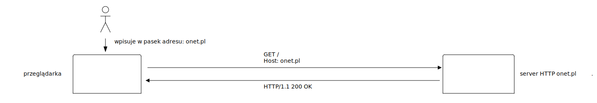
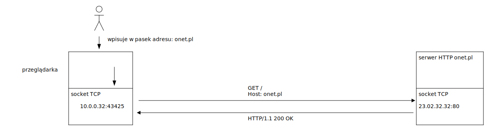
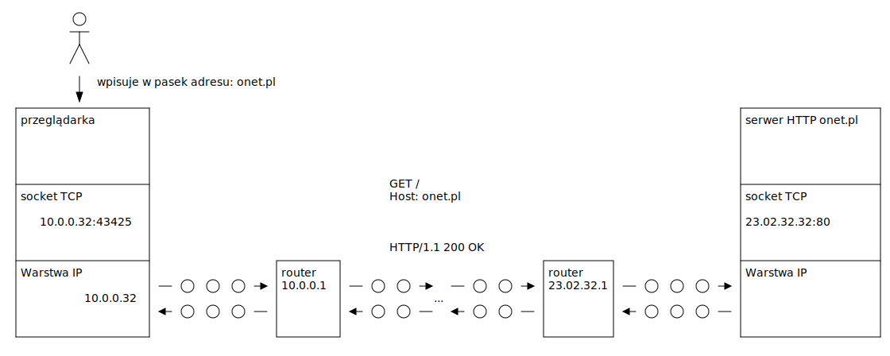
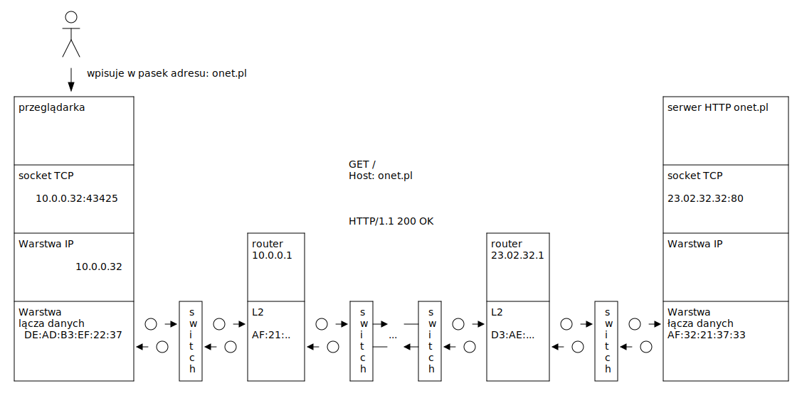

# Zagadnienie 3: Obsługa plików

## Komunikacja międzyprocesowa

## Komunikacja międzyprocesowa

## Komunikacja międzyprocesowa

## Komunikacja międzyprocesowa

## Komunikacja międzyprocesowa

# Dziękuję za uwagę
