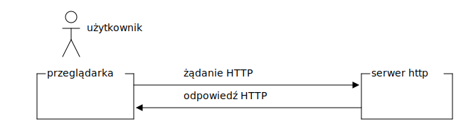
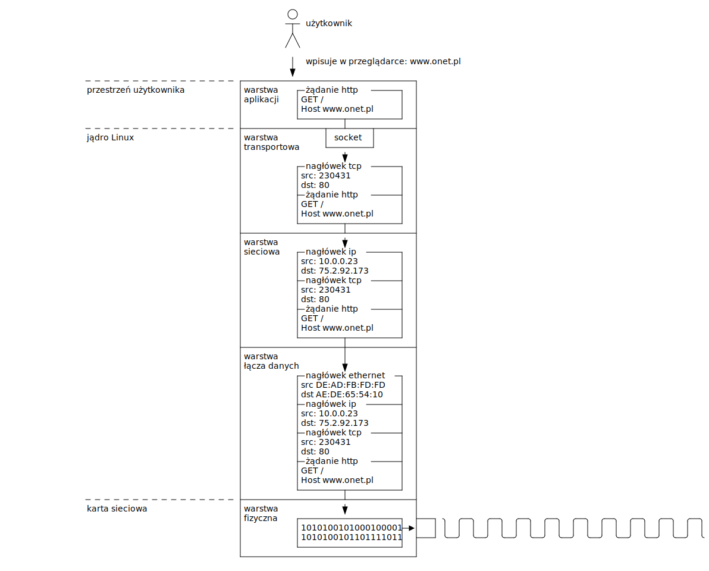
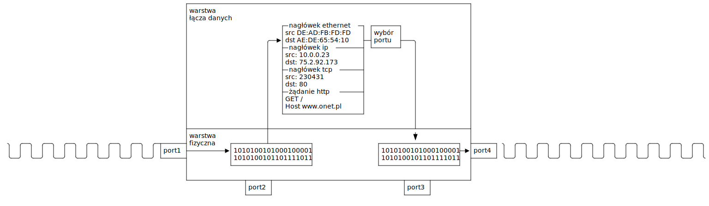
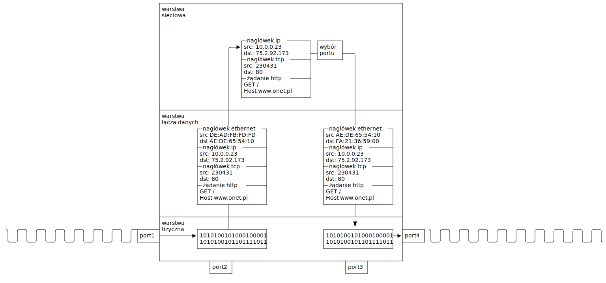
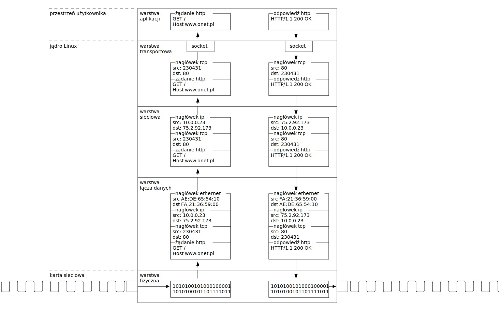
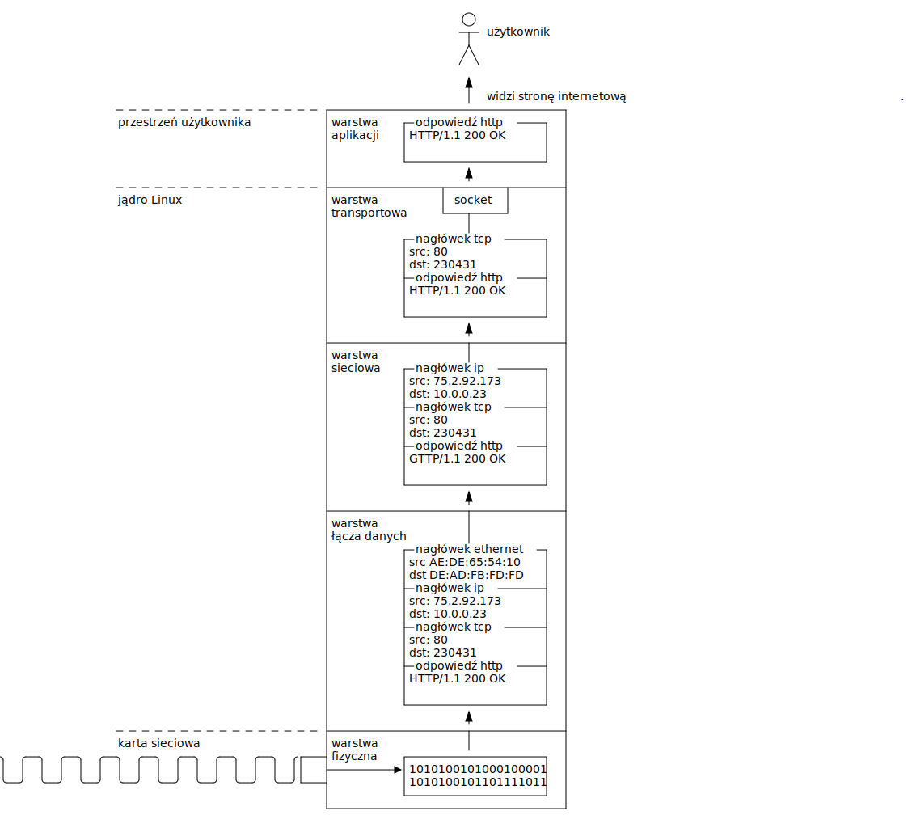

# Zagadnienie 4: Komunikacja sieciowa

## Informacje wstępne - tablice

Tablicą nazwywamy ciąg elementów takiego samego typu.

Przykłady tablic:
```c
float numbers[4] = {1.0f, -1.0f, -2.0f, -3.0f};
int a[] = {1, 2, 3, 4, 5, 6, 7, 8, 9, 10};
char name[] = { 'S', 't', 'e', 'f', 'a', 'n', 0 };
char name2[] = "Stefan";
```

Elementy tablicy są ułożone pod kolejnymi adresami w pamięci:
```c
int values[] = {1, 2, 3};
```

```
0x4 0x8 0xb
  +---+---+---+
  | 1 | 2 | 3 |
  +---+---+---+
```

## Informacje wstępne - nazwa tablicy jest wskaźnikiem do pierwszego elementu

```c
int values[] = {1, 2, 3};
int *p = values;
```

```
0x4 0x8 0xb             p
  +---+---+---+          +---+
  | 1 | 2 | 3 |          |0x4|
  +---+---+---+          +---+
  ^------------------------'
```

## Informacje wstępne - struktury

O ile tablice reprezentowały ciąg elementów takiego samego typu, to struktury
reprezentują zbiór elementów o możliwie różnych typach.

Definicja struktury:
```c
struct person {
    int age;
    float salary;
    char name[16];
};
```

Utworzenie obiektu struktury i wypełnienie pól:
```c
struct person p;
p.age = 46;
p.salary = 1029384732.0f;
snprintf(p.name, sizeof(name), "%s", "Daniel");
```

## Informacje wstępne - struktury - inicjalizacja

Strukturę można zainicjalizować podając kolejno jej elementy.
```c
struct person p = { 46, 1029384732.0f, "Daniel" };

/* Rekomendowaną praktyką jest stosowanie "designated initializers" z C99 */
struct person p2 = {
    .age = 46,
    .salary = 1029384732.0f,
    .name = "Daniel",
    /* Pola pominięte bedą zainicjalizowane zerami */
};
```

Inicjalizacja struktury samymi zerami:
```c
struct person p = {0};
```

## Informacje wstępne - struktury układ w pamięci

```c
struct foo {
    char a;
    int b;
    int c;
};
```
Jeżeli kompilujemy program na architekturę, gdzie `sizeof(int) == 4`, to wtedy
struktura może wyglądać w pamięci następujący sposób:
```
+---+---+---+---+---+---+---+---+---+
| a |       b       |       c       |
+---+---+---+---+---+---+---+---+---+
```
**Czy aby na pewno?**

## Informacje wstępne - padding

Niestety, w praktyce najprawdopodobniej kompilator wyrówna pola struktury tak
aby adresy były podzielne np. przez 4, ponieważ w ten sposób procesor może
je szybciej zaadresować:
```c
struct foo {
    char a;
    int b;
    int c;
};
```
```
+---+---+---+---+---+---+---+---+---+---+---+---+
| a |  padding  |       b       |       c       |
+---+---+---+---+---+---+---+---+---+---+---+---+
```
Wartość `sizeof(struct foo)` najprawdopodobniej wyniesie `12`, a nie  `9`.

**Jak pozbyć się/ograniczyć padding?**


## Informacje wstępne - ograniczenie paddingu

Padding można ograniczyć zamieniając kolejność pól. Optymalizując struktury w
ten sposób, można zaoszczędzić pamięć.

```c
struct foo {
    int b;
    int c;
    char a;
};
```
```
+---+---+---+---+---+---+---+---+---+
|       b       |       c       | a |
+---+---+---+---+---+---+---+---+---+
```

Alternatywnie, kompilatory oferują **niestandardowe** rozszerzenia umożliwiające
wyłączenie paddingu: `#pragma pack` w MSVC i `__attribute__((packed))` w `gcc`.

## Informacje wstępne - operacje na strukturach

Struktury obsługują operator przypisania `=`, który powoduje przekopiowanie
wartości każdego pola.

```c
struct vec2 {
    float x;
    float y;
};

struct vec2 position_a = { 2.0f, 10.0f };
struct vec2 position_b = position_a;

printf("%f %f", position_b.x, position_b.y);
```

## Informacje wstępne - definicja i utworzenie obiektu w jednym

Strukturę możemy zdefiniować i od razu utworzyć zmienną jej typu:

```c
struct player_config {
    struct vec2 velocity;
    char name[32];
    int max_hp;
} configuration = {
    .velocity = { 0.0f, 1.0f },
    .name = "Marian",
    .max_hp = 200,
};

printf("%s", configuration.name);
```

## Informacje wstępne - anonimowe struktury

Gdy od razu tworzymy zmienną możemy pominąć nazwę typu:

```c
struct {
    struct vec2 velocity;
    char name[32];
    int max_hp;
} configuration = {
    .velocity = { 0.0f, 1.0f },
    .name = "Marian",
    .max_hp = 200,
};

printf("%s", configuration.name);
```

## Informacje wstępne - tablice struktur

Nic nie stoi na przeszkodzie aby łączyć tablice i struktury:
```c
struct month_info {
    int number;
    int days;
    char name[32];
};
struct month_info months[] = {
    { .number = 1, .days = 31, .name = "January" },
    { .number = 2, .days = 28, .name = "February" },
    { .number = 3, .days = 31, .name = "March" },
    { .number = 4, .days = 30, .name = "April" },
    { .number = 5, .days = 31, .name = "May" },
    { .number = 6, .days = 30, .name = "June" },
    { .number = 7, .days = 31, .name = "July" },
    { .number = 8, .days = 31, .name = "August" },
    { .number = 9, .days = 30, .name = "September" },
    { .number = 10, .days = 31, .name = "October" },
    { .number = 11, .days = 30, .name = "November" },
    { .number = 12, .days = 31, .name = "December" },
};
```

## Informacje wstępne - wskaźniki na struktury

```c
struct foo { int a; };
```
Do pól struktury odnosimy się używając operatora `.`:
```c
struct foo foo = { 1 }:

printf("%d\n", foo.a);
```

Do pól struktury poprzez wskaźnik odnosimy się używając operatora `->`:
```c
struct foo foo = { 1 };
struct foo *bar = &foo;

printf("%d\n", bar->a);
printf("%d\n", (*bar).a);
```

## Informacje wstępne - lista jednokierunkowa
Lista jednokierunkowa, podobnie jak tablica pozwala na utworzenie kolekcji elementów
takiego samego typu - z tą różnicą że elementy nie będą ułożone kolejno w pamięci.
```c
struct book {
    /* Wskaźnik do następnego elementu */
    struct book *next;
    char title[128];
};
```

```c
struct book book1 = { .next = NULL, .title = "Harry Potter i Tablica Charów" };
struct book book2 = { .next = &book1, .title = "Harry Router i Maska Podsieci" };
struct book book3 = { .next = &book2, .title = "Alicja na Wydziale Informatyki" };
```

```c
for (struct book *book = &book3; book != NULL; book = book->next)
    printf("tytul: %s\n", book->title);
```

# Protokół HTTP

## Każda strona internetowa to dokument hipertekstowy


## Hipertekstowy język znaczników (HTML)

Język HTML, służy do formułowania dokumentów hipertekstowych, które
następnie są prezentowane przez przeglądarke jako strona internetowa.

```html
<!doctype html>
<html lang="pl">
    <head>
        <meta charset="utf-8">
        <meta http-equiv="X-UA-Compatible" content="IE=edge">
        <meta name="viewport" content="width=device-width, initial-scale=1">
        <title>Title</title>
    </head>
    <body>
        <h1>Witaj świecie</h1>
        <p>Oto pierwszy akapit</p>
    </body>
</html>
```

## Hipertekstowy język znaczników - efekt

Po wyrenderowaniu HTML, przez przeglądarke otrzymujemy następujący efekt:


## Protokół przesyłania dokumentów hipertekstowych (HTTP)

Do przesyłania dokumentów HTML poprzez sieć służy protokół HTTP.
Gdy użytkownik chce wejśc na daną stronę internetową, to przeglądarka
wysyła żądanie HTTP do serwera HTTP. Następnie serwer odsyła przeglądarce
odpowiedź.



## Żądanie HTTP
Żądanie HTTP ma format tekstowy. Składa się z nagłówków zapytania oraz
opcjonalnego ciała.
```
METODA ZASÓB WERSJA_HTTP
Nagłówek1: Wartość1
Nagłówek2: Wartość2

<opcjonalne ciało>
```

Przykład:
```
GET /index.html HTTP/1.1
Host: example.com
User-Agent: Mozilla/5.0 (X11; Ubuntu; Linux x86_64; rv:98.0) Gecko/20100101 Firefox/98.0
Accept: */*


```
W `HTTP/1.1` wymaganym nagłówkiem jest `Host`, reszta jest opcjonalna.

## Odpowiedź HTTP

Odpowiedź HTTP ma format tekstowy. Składa się z linii statusu, nagłówków 
zapytania oraz opcjonalnego ciała:

```
HTTP/1.1 KOD_ODPOWIEDZI NAZWA_KODU
Nagłówek1: Wartość1
Nagłówek2: Wartość2

<opcjonalne ciało>
```

## Odpowiedź HTTP - przykład

Przykładowa odpowiedź HTTP:
```
HTTP/1.1 200 OK
Content-Type: text/html; charset=UTF-8
Date: Thu, 07 Apr 2022 15:32:42 GMT
Content-Length: 353

<!doctype html>
<html lang="pl">
    <head>
        <meta charset="utf-8">
        <meta http-equiv="X-UA-Compatible" content="IE=edge">
        <meta name="viewport" content="width=device-width, initial-scale=1">
        <title>Title</title>
    </head>
    <body>
        <h1>Witaj świecie</h1>
        <p>Oto pierwszy akapit</p>
    </body>
</html>
```

# Droga pakietu w sieci

## Droga pakietu - wysłanie pakietu



## Droga pakietu - switch



## Droga pakietu - router



## Droga pakietu - serwer



## Droga pakietu - odebranie pakietu



# Gniazda sieciowe POSIX

## Komunikacja klienta z serwerem


## Funkcje/wywołania systemowe po stronie klienta

Po stronie klienta:

- `getaddrinfo()`
- `socket()`
- `connect()`
- `read()`
- `write()`
- `close()`

## Funkcja `getaddrinfo()`

Funkcja `getaddrinfo()` służy do odpytywania usługi DNS.

```c
#include <sys/types.h>
#include <sys/socket.h>
#include <netdb.h>

/**
 * @node: nazwa docelowa np. "onet.pl"
 * @service: nazwa usługi np "http" lub "80"
 * @hints: podpowiedzi
 * @res: wynik odpytania usługi DNS
 */
int getaddrinfo(const char *node, const char *service,
               const struct addrinfo *hints,
               struct addrinfo **res);
```
Otrzymany wynik należy "zwolnić" za pomocą `freeaddrinfo()`
```c
void freeaddrinfo(struct addrinfo *res);
```

## Funkcja `getaddrinfo()` przykład

```c
struct addrinfo hints = {
    .ai_family = AF_INET,
    .ai_socktype = SOCK_STREAM,
    .ai_protocol = IPPROTO_TCP,
};

struct addrinfo *result = NULL;
int ret = getaddrinfo("onet.pl", "80", &hints, &result);
if (ret) {
    /* Nie udało się przetłumaczyć nazwy */
}

/* Iterujemy się po każdyn znalezionym adresie */
for (struct addrinfo *i = result; i != NULL; i = i->ai_next) {
    char ip[NI_MAXHOST] = {0};
    /* i->ai_addr i i->ai_addrlen zawierają adres ip */
    getnameinfo(i->ai_addr, i->ai_addrlen, ip, sizeof(ip), NULL, 0, NI_NUMERICHOST);
    printf("IP serwisu onet.pl: %s\n", ip);
}

freeaddrinfo(result);
```

## Wywołanie systemowe `socket()`

Wywołanie systemowe `socket()` otwiera gniazdo sieciowe, za pomocą
którego możemy komunikować się poprzez sieć.

```c
#include <sys/types.h>
#include <sys/socket.h>

/**
 * @domain: Rodzina socketu np. AF_INET, AF_INET6
 * @type: Typ socketu np. SOCK_STREAM, SOCK_DGRAM
 * @protocol: Protokół np. IPPROTO_TCP, IPPROTO_UDP
 */
int socket(int domain, int type, int protocol);
```

Na przykład możemy utrzowyć gniazdo TCP:
```c
int fd = socket(AF_INET, SOCK_STREAM, IPPROTO_TCP);
if (fd < 0) {
    /* Wystąpił błąd */
}
```

## Wywołanie systemowe `close()`

Wywołanie systemowe `close()` zamyka gniazdo sieciowe.
```c
#include <unistd.h>

int close(int fd);
```

Przykład:
```
close(fd);
```

## Wywołanie systemowe `connect()`

Wywołanie systemowe `connect()` nawiązuje połączenie

```c
#include <sys/socket.h>

/**
 * @socket: gniazdo sieciowe, które chcemy połączyć
 * @address: adres, z którym chcemy się połączyć
 * @address_len: długość adresu
 */
int connect(int socket, const struct sockaddr *address, socklen_t address_len);
```

Można wykorzystać pola `ai_addr` i `ai_addrlen` ze struktury `struct addrinfo`,
otrzymanej z `getaddrinfo()`. Przykład:

```c
int ret = connect(fd, i->ai_addr, i->ai_addrlen);
if (ret) {
    /* Nie udało się przypisać adresu */
}
```

## Wywołanie systemowe `read()`

Dane z gniazda sieciowego odczytujemy podobnie jak dane z pliku:
```c
/**
 * @fd: gniazdo siecowe
 * @buf: miejsce w pamięci gdzie zostaną zapisane odebrane dane z gniazda sieciowego
 * @count: liczba bajtów do odczytania
 */
ssize_t read(int fd, void *buf, size_t count);
```

Przykład - odczytanie z gniazda do 32 bajtów:
```c
char bytes[32];
ssize_t count = read(fd, bytes, sizeof(bytes));
if (count == 0) {
    /* Zakończenie połączenia */
}
if (count < 0) {
    /* Bląd */
}
```

## Wywołanie systemowe `write()`

Wysyłanie danych przez gniazdo sieciowe odbywa się podobnie jak zapisywanie
danych do pliku.

```c
/**
 * @fd: gniazdo sieciowe
 * @buf: miejsce w pamięci z którego zostaną wysłane dane przez gniazdo
 * @count: liczba bajtów do wysłania
 */
ssize_t write(int fd, const void *buf, size_t count);
```

Przykład - wysłanie ciągu znaków `"Hello world"` przez sieć:
```c
char text[] = "Hello world";

ssize_t count = write(fd, text, sizeof(text));
if (count != sizeof(text)) {
    /* Nie wszystko się udało wysłać - błąd */
}
```

## Prosty klient HTTP

Zacznijmy od napisania funkcji która zwróci gniazdo połączone z
serwerem http.

```c
int connected_socket(const char *addr, const char *port)
{
	struct addrinfo hints = {
		.ai_family = AF_INET,
		.ai_socktype = SOCK_STREAM,
		.ai_protocol = IPPROTO_TCP,
	};

	struct addrinfo *result;
	int ret = getaddrinfo(addr, port, &hints, &result);
	if (ret)
		return -1;

	int fd = -1;
	for (struct addrinfo *i = result; i != NULL; i = i->ai_next) {
		fd = socket(i->ai_family, i->ai_socktype, i->ai_protocol);
		if (fd < 0)
			continue;

		ret = connect(fd, i->ai_addr, i->ai_addrlen);
		if (ret) {
			close(fd);
			fd = -1;
			continue;
		}

		break;
	}
	freeaddrinfo(res);
	return fd;
}
```

## Prosty klient HTTP - żądanie i odpowiedź

```c
#include <sys/types.h>
#include <sys/socket.h>
#include <netdb.h>
#include <unistd.h>
#include <stdio.h>

int connected_socket(const char *addr, const char *port) { ... }

int main(int argc, char **argv)
{
	int fd = connected_socket("example.com", "80");
	if (fd < 0)
		return 1;

	char http_request[] =
		"GET / HTTP/1.1\r\n"
		"Host: example.com\r\n"
		"Connection: close\r\n"
		"\r\n";
	int count = write(fd, http_request, sizeof(http_request));
	if (count <= 0) {
		close(fd);
		return 1;
	}

	while (1) {
		char buf[9000] = {0};
		count = read(fd, buf, sizeof(buf) - 1);
		if (count <= 0)
			break;
		printf("%s", buf);
	}
	close(fd);
	return 0;
}
```

## Prosty klient HTTP - efekt

```
$ ./a.out
HTTP/1.1 200 OK
Accept-Ranges: bytes
Age: 482357
Cache-Control: max-age=604800
Content-Type: text/html; charset=UTF-8
Date: Thu, 07 Apr 2022 19:42:28 GMT
Etag: "3147526947"
Expires: Thu, 14 Apr 2022 19:42:28 GMT
Last-Modified: Thu, 17 Oct 2019 07:18:26 GMT
Server: ECS (nyb/1D1B)
Vary: Accept-Encoding
X-Cache: HIT
Content-Length: 1256
Connection: close

<!doctype html>
<html>
<head>
    <title>Example Domain</title>
    ...
```

## Funkcje/wywołania systemowe po stronie serwera

Po stronie serwera, używany jest następujący zestaw funkcji:

- `getaddrinfo()`
- `socket()`
- `bind()`
- `listen()`
- `accept()`
- `read()`
- `write()`
- `close()`

## Wywołanie systemowe `bind()`

Wywołanie systemowe `bind()` przypisuje adres do gniazda sieciowego.

```c
#include <sys/socket.h>

/**
 * @socket: gniazdo sieciowe do którego chcemy przypisać adres
 * @address: adres, który chcemy przypisać
 * @address_len: długość adresu
 */
int bind(int socket, const struct sockaddr *address, socklen_t address_len);
```

Można wykorzystać pola `ai_addr` i `ai_addrlen` ze struktury `struct addrinfo`,
otrzymanej z `getaddrinfo()`. Przykład:

```c
int ret = bind(fd, i->ai_addr, i->ai_addrlen);
if (ret) {
    /* Nie udało się przypisać adresu */
}
```

## Funkcja `getaddrinfo()` - adres do nasłuchiwania

Żeby funkcja `getaddrinfo()` zwróciła nam adres na którym możemy
nasłuchiwać połączeń przychodzących, musimy użyc flagi `AI_PASSIVE`:

```c
struct addrinfo hints = {
    .ai_family = AF_INET,
    .ai_socktype = SOCK_STREAM,
    .ai_protocol = IPPROTO_TCP,
    .ai_flags = AI_PASSIVE,
};

struct addrinfo *result = NULL;
int ret = getaddrinfo(NULL, "8080", &hints, &result);
if (ret)
    return 1;
```

## Tworzenie nasłuchującego gniazda


```c
int fd;
for (struct addrinfo *i = result; i != NULL; i = i->ai_next) {
    fd = socket(i->ai_family, i->ai_socktype, i->ai_protocol);
    if (fd < 0)
        continue;

    err = bind(fd, i->ai_addr, i->ai_addrlen);
    if (err) {
        close(fd);
        continue;
    }

    int err = listen(fd, 16);
    if (err) {
        close(fd);
        continue;
    }

    break;
}

freeaddrinfo(result);
```

## Wywołanie systemowe `listen()`

Wywołanie systemowe `listen()` przełącza socket w tryb nasłuchiwania.

```c
#include <sys/socket.h>

/**
 * @socket: gniazdo sieciowe
 * @backlog: maksymalny rozmiar kolejki oczekujących połączeń
 */
int listen(int socket, int backlog);
```

Przykładowe wywołanie:
```c
int error = listen(fd, 16);
if (error) {
    /* Wystąpił błąd */
}
```

## Wywołanie systemowe `accept()`

Wywołanie systemowe `accept()` blokuje program do momentu połączenia się klienta.
Po nawiązaniu połączenia z klientem, `accept()` odblokowywuje program i zwraca
gniazdo sieciowe służące do komunikacji z klientem.

```c
#include <sys/socket.h>
/**
 * @socket: gniazdo sieciowe nasłuchujące na połączenia
 * @address: wskaźnik do struktury w której zostanie zapisany adres klienta, NULL jeśli nas to nie interesuje
 * @address_len: wskaźnik do zmiennej, w której zostanie zapisana długość adresu, NULL jeśli nas to nie intersuje */
int accept(int socket, struct sockaddr *restrict address, socklen_t *restrict address_len);
```

Przykład:
```c
int client_socket = accept(server_socket, NULL, NULL);
if (client_socket < 0) {
    /* Wystąpił błąd */
}
write(client_socket, "Czesc!", strlen("Czesc") + 1);
```

# Dziękuję za uwagę
