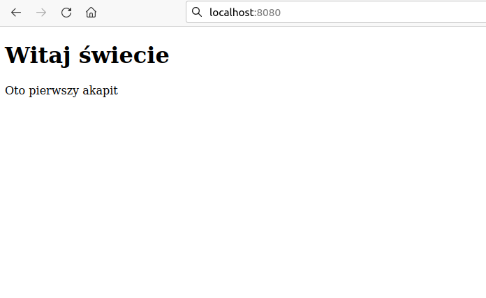

# Prosty serwer HTTP

Celem zadania jest implementacja prostego serwera HTTP, który będzie
serwował jedną stronę HTML.

W implementacji można zastosować następujące uproszczenia

- Wspieramy tylko metodę `GET`
- Nie trzeba analizować żądania `HTTP`, bo zawsze udzielamy identycznej odpowiedzi.
  wystarczy tylko ją odczytać z gniazda
- Zawsze udzielamy tej samej odpowiedzi

# Przykład działania

Uruchomienie serwera HTTP
```
$ ./http-server
```

Po uruchomieniu, serwer powinien nasłuchiwać połączeń przychodzących i odsyłać
odpowiedź na żądania HTTP.

Przykład - odpytanie serwera tekstową przeglądarką `curl`:
```
$ curl -si http://localhost:8081
HTTP/1.1 200 OK
Content-Type: text/html
Connection: close
Content-Length: 353

<!doctype html>
<html lang="pl">
    <head>
        <meta charset="utf-8">
        <meta http-equiv="X-UA-Compatible" content="IE=edge">
        <meta name="viewport" content="width=device-width, initial-scale=1">
        <title>Title</title>
    </head>
    <body>
        <h1>Witaj świecie</h1>
        <p>Oto pierwszy akapit</p>
    </body>
</html>
```

Przykład - odpytanie serwera przeglądarką Firefox



# Przydatne funkcje

Do implementacji serwera przydadzą się następujące funkcje:

- `getaddrinfo()` - odpytanie systemu o możliwe adresy do nasłuchiwania
- `socket()` - utworzenie gniazda sieciowego
- `bind()` - przypisanie gniazdu sieciowemu adresu do nasłuchiwania
- `listen()` - ustawienie gniazda sieciowego w tryb nasłuchiwania
- `accept()` - oczekiwanie na połączenie klienta
- `read()` - odebranie żądania od klienta
- `write()` - wysłanie odpowiedzi do klienta
- `close()` - zamknięcie połączenia

## Tworzenie gniazda w trybie nasłuchiwania

Do utworzenia gniazda w trybie nasłuchiwania można użyć poniższej funkcji.
Zwraca ona deskryptor pliku gniazda, które nasłuchuje na połączenia przychodzące
lub wartość ujemną, jeżeli wystąpił błąd.
```
int listening_socket(const char *port)
{
	struct addrinfo hints = {
		.ai_family = AF_INET,
		.ai_socktype = SOCK_STREAM,
		.ai_protocol = IPPROTO_TCP,
		.ai_flags = AI_PASSIVE,
	};

	struct addrinfo *result;
	int ret = getaddrinfo(NULL, port, &hints, &result);
	if (ret)
		return -1;

	int fd = -1;
	for (struct addrinfo *i = result; i != NULL; i = i->ai_next) {
		fd = socket(i->ai_family, i->ai_socktype, i->ai_protocol);
		if (fd < 0)
			continue;

		ret = bind(fd, i->ai_addr, i->ai_addrlen);
		if (ret) {
			close(fd);
			fd = -1;
			continue;
		}

		ret = listen(fd, 16);
		if (ret) {
			close(fd);
			fd = -1;
			continue;
		}
		break;
	}

	return fd;
}
```

## Przygotowanie odpowiedzi HTTP

W celu poprawnego sformułowania odpowiedzi HTTP, którą będziemy wysyłać, musimy
wstawić właściwą wartość w nagłówku `Content-Length`. Musi być ona równa długości
odsyłanego ciała zapytania. 

Możemy to zrobić w poniższy sposób. Tablica `response` zawiera odpowiedź którą,
należy odesłać za pomocą `write()`.
```c
char http_response_template[] =
	"HTTP/1.1 200 OK\r\n"
	"Content-Type: text/html\r\n"
	"Connection: close\r\n"
	"Content-Length: %d\r\n"
	"\r\n"
	"%s"
;
char html[] =
	"<!doctype html>\n"
	"<html lang=\"pl\">\n"
	"    <head>\n"
	"        <meta charset=\"utf-8\">\n"
	"        <meta http-equiv=\"X-UA-Compatible\" content=\"IE=edge\">\n"
	"        <meta name=\"viewport\" content=\"width=device-width, initial-scale=1\">\n"
	"        <title>Title</title>\n"
	"    </head>\n"
	"    <body>\n"
	"        <h1>Witaj świecie</h1>\n"
	"        <p>Oto pierwszy akapit</p>\n"
	"    </body>\n"
	"</html>\n"
;

char response[4096];
snprintf(response, sizeof(response), http_response_template,
	 strlen(html), html);
```

## Szkielet programu

Można wykorzystać następujący szkielet programu:
```c
#include <sys/types.h>
#include <sys/socket.h>
#include <netdb.h>
#include <unistd.h>
#include <stdio.h>
#include <string.h>

int listening_socket(const char *port) { ... }

int main(void)
{
	int socket_fd = listening_socket("8080");
	if (socket_fd < 0) {
		perror("server: error: \n");
		return 1;
	}

	while (1) {
		// Akceptacja połączenia

		// Odczytanie żądania

		// Odesłanie odpowiedzi

		// Zamknięcie połączenie klientowi
	}

	close(socket_fd);
}
```
