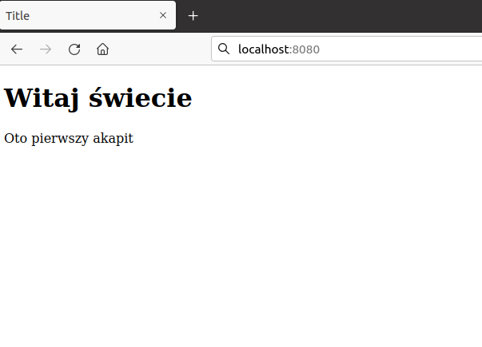

# Prosty serwer HTTP - rozwiązanie

## Krok 1

Pierwszym krokiem jest napisanie funkcji `main()` i załączenie odpowiednich
nagłówków:

```c
#include <sys/types.h>
#include <sys/socket.h>
#include <netdb.h>
#include <unistd.h>
#include <stdio.h>
#include <string.h>

int main(int argc, char **argv)
{
	return 0;
}
```

## Krok 2

Pierwszym krokiem jest napisanie funkcji, która utworzy gniazdo sieciowe
nasłuchujące na wszystkich interfejsach.

```c
#include <sys/types.h>
#include <sys/socket.h>
#include <netdb.h>
#include <unistd.h>
#include <stdio.h>
#include <string.h>

int listening_socket(const char *port)
{
	struct addrinfo hints = {
		.ai_family = AF_INET,
		.ai_socktype = SOCK_STREAM,
		.ai_protocol = IPPROTO_TCP,
		.ai_flags = AI_PASSIVE,
	};

	struct addrinfo *result;
	int ret = getaddrinfo(NULL, port, &hints, &result);
	if (ret)
		return -1;

	int fd = -1;
	for (struct addrinfo *i = result; i != NULL; i = i->ai_next) {
		fd = socket(i->ai_family, i->ai_socktype, i->ai_protocol);
		if (fd < 0)
			continue;

		ret = bind(fd, i->ai_addr, i->ai_addrlen);
		if (ret) {
			close(fd);
			fd = -1;
			continue;
		}

		ret = listen(fd, 16);
		if (ret) {
			close(fd);
			fd = -1;
			continue;
		}


		break;
	}

	return fd;
}

int main(int argc, char **argv)
{
	return 0;
}
```

## Krok 3

Następnie tworzymy gniazdo sieciowe wywołując tą funkcję:

```c
#include <sys/types.h>
#include <sys/socket.h>
#include <netdb.h>
#include <unistd.h>
#include <stdio.h>
#include <string.h>

int listening_socket(const char *port) { ... }

int main(int argc, char **argv)
{
	int server_fd = listening_socket("8080");
	if (server_fd < 0)
		return 1;

	close(server_fd);
}
```

## Krok 4

Nasz prosty serwer HTTP, musi oczekiwać na połączenia od klientów. Do oczekiwania
na połączenie nowego klienta służy funkcja `accept()`. Wykorzystajmy więc funkcję
`accept()`, w celu poczekania na połączenie klienta.

```c
#include <sys/types.h>
#include <sys/socket.h>
#include <netdb.h>
#include <unistd.h>
#include <stdio.h>
#include <string.h>

int listening_socket(const char *port) { ... }

int main(int argc, char **argv)
{
	int server_fd = listening_socket("8080");
	if (server_fd < 0)
		return 1;

	int fd = accept(server_fd, NULL, NULL);
	if (fd < 0)
		goto err;
	close(fd);
err:
	close(server_fd);
}
```

## Krok 5

Napisaliśmy program, który będzie czekał na połączenie od klienta, następnie
od razu zamknie połączenie z klientem za pomocą funkcji `close()` i na końcu
się zakończy.

Chcemy aby nasz serwer, po obsłużeniu klienta dalej działał. Aby to osiągnąć
musimy oczekiwać na połączenia w pętli.

```c
#include <sys/types.h>
#include <sys/socket.h>
#include <netdb.h>
#include <unistd.h>
#include <stdio.h>
#include <string.h>

int listening_socket(const char *port) { ... }

int main(int argc, char **argv)
{
	int server_fd = listening_socket("8080");
	if (server_fd < 0)
		return 1;

	while (1) {
		int fd = accept(server_fd, NULL, NULL);
		if (fd < 0)
			continue;
		close(fd);
	}

	close(server_fd);
}
```

## Krok 6

Nasz serwer potrafi już akceptować połączenia od klientów. Naszym celem jest
jednak zwrócenie odpowiedzi HTTP, na zapytanie HTTP od klienta.
Przygotujmy więc ciąg znaków zawierający odpowiedź HTTP.

```c
#include <sys/types.h>
#include <sys/socket.h>
#include <netdb.h>
#include <unistd.h>
#include <stdio.h>
#include <string.h>

int listening_socket(const char *port) { ... }

int main(int argc, char **argv)
{
	int server_fd = listening_socket("8080");
	if (server_fd < 0)
		return 1;

	while (1) {
		int fd = accept(server_fd, NULL, NULL);
		if (fd < 0)
			continue;

		char http_response_template[] =
			"HTTP/1.1 200 OK\r\n"
			"Content-Type: text/html\r\n"
			"Connection: close\r\n"
			"Content-Length: %d\r\n"
			"\r\n"
			"%s"
		;
		char html[] =
			"<!doctype html>\n"
			"<html lang=\"pl\">\n"
			"    <head>\n"
			"        <meta charset=\"utf-8\">\n"
			"        <meta http-equiv=\"X-UA-Compatible\" content=\"IE=edge\">\n"
			"        <meta name=\"viewport\" content=\"width=device-width, initial-scale=1\">\n"
			"        <title>Title</title>\n"
			"    </head>\n"
			"    <body>\n"
			"        <h1>Witaj świecie</h1>\n"
			"        <p>Oto pierwszy akapit</p>\n"
			"    </body>\n"
			"</html>\n"
		;

		char response[4096];
		snprintf(response, sizeof(response), http_response_template,
			 strlen(html), html);

		close(fd);
	}

	close(server_fd);
}
```

## Krok 7

Celem serwera HTTP jest zwrócenie odpowiedzi na żądanie HTTP od klienta.
Nasz uproszczony serwer, nie musi analizować żądania HTTP, ponieważ będzie
zwracał zawsze taką samą odpowiedź. Więc wystarczy tylko że odczytamy żądanie
od klienta i następnie zignorujemy jego zawartość. Do odczytania wiadomości
od klienta służy wywołanie systemowe `read()`.

```c
#include <sys/types.h>
#include <sys/socket.h>
#include <netdb.h>
#include <unistd.h>
#include <stdio.h>
#include <string.h>

int listening_socket(const char *port) { ... }

int main(int argc, char **argv)
{
	int server_fd = listening_socket("8080");
	if (server_fd < 0)
		return 1;

	while (1) {
		int fd = accept(server_fd, NULL, NULL);
		if (fd < 0)
			continue;

		char http_response_template[] =
			"HTTP/1.1 200 OK\r\n"
			"Content-Type: text/html\r\n"
			"Connection: close\r\n"
			"Content-Length: %d\r\n"
			"\r\n"
			"%s"
		;
		char html[] =
			"<!doctype html>\n"
			"<html lang=\"pl\">\n"
			"    <head>\n"
			"        <meta charset=\"utf-8\">\n"
			"        <meta http-equiv=\"X-UA-Compatible\" content=\"IE=edge\">\n"
			"        <meta name=\"viewport\" content=\"width=device-width, initial-scale=1\">\n"
			"        <title>Title</title>\n"
			"    </head>\n"
			"    <body>\n"
			"        <h1>Witaj świecie</h1>\n"
			"        <p>Oto pierwszy akapit</p>\n"
			"    </body>\n"
			"</html>\n"
		;

		char response[4096];
		snprintf(response, sizeof(response), http_response_template,
			 strlen(html), html);

		char buf[9000] = {0};
		int count = read(fd, buf, sizeof(buf) - 1);
		if (count <= 0)
			break;

		close(fd);
	}

	close(server_fd);
}
```

## Krok 8

Po odczytaniu żądania, należy odesłać odpowiedź. Odeślijmy więc do klienta
w odpowiedzi wiadomość HTTP, której treść umieściliśmy wcześniej w zmiennej
`response`. Do wysłania odpowiedzi służy funkcja `write()`.

Ostateczny kod programu wygląda następująco:
```c
#include <sys/types.h>
#include <sys/socket.h>
#include <netdb.h>
#include <unistd.h>
#include <stdio.h>
#include <string.h>

int listening_socket(const char *port) { ... }

int main(int argc, char **argv)
{
	int server_fd = listening_socket("8080");
	if (server_fd < 0)
		return 1;

	while (1) {
		int fd = accept(server_fd, NULL, NULL);
		if (fd < 0)
			continue;

		char http_response_template[] =
			"HTTP/1.1 200 OK\r\n"
			"Content-Type: text/html\r\n"
			"Connection: close\r\n"
			"Content-Length: %d\r\n"
			"\r\n"
			"%s"
		;
		char html[] =
			"<!doctype html>\n"
			"<html lang=\"pl\">\n"
			"    <head>\n"
			"        <meta charset=\"utf-8\">\n"
			"        <meta http-equiv=\"X-UA-Compatible\" content=\"IE=edge\">\n"
			"        <meta name=\"viewport\" content=\"width=device-width, initial-scale=1\">\n"
			"        <title>Title</title>\n"
			"    </head>\n"
			"    <body>\n"
			"        <h1>Witaj świecie</h1>\n"
			"        <p>Oto pierwszy akapit</p>\n"
			"    </body>\n"
			"</html>\n"
		;

		char response[4096];
		snprintf(response, sizeof(response), http_response_template,
			 strlen(html), html);

		char buf[9000] = {0};
		int count = read(fd, buf, sizeof(buf) - 1);
		if (count <= 0)
			break;

		write(fd, response, strlen(response));
		close(fd);
	}

	close(server_fd);
}
```

## Kompilacja i uruchomienie

Program możemy skompilować i uruchomić w następujący sposób

```bash
$ gcc main.c
$ ./a.out
```

Po uruchomieniu programu i wejściu w przeglądarce na adres `http://localhost:8080`
naszym oczom powinno się ukazać:



W celu weryfikacji możemy też skorzystać z tekstowej przeglądarki internetowej
o nazwie `curl`:

```bash
$ curl http://localhost:8080/
<!doctype html>
<html lang="pl">
    <head>
        <meta charset="utf-8">
        <meta http-equiv="X-UA-Compatible" content="IE=edge">
        <meta name="viewport" content="width=device-width, initial-scale=1">
        <title>Title</title>
    </head>
    <body>
        <h1>Witaj świecie</h1>
        <p>Oto pierwszy akapit</p>
    </body>
</html>
```

